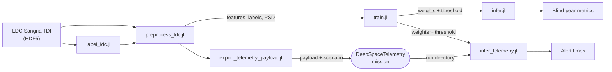

# MilliHertzQML.jl

[](https://github.com/PaulGoG/MilliHertzQML.jl/actions/workflows/CI.yml)
[](https://codecov.io/gh/PaulGoG/MilliHertzQML.jl)
[](https://PaulGoG.github.io/MilliHertzQML.jl/stable/)
[](https://github.com/PaulGoG/MilliHertzQML.jl/releases)
[](https://julialang.org/)
[](https://github.com/JuliaTesting/Aqua.jl)
[](LICENSE)

A variational quantum classifier with data re-uploading that detects
massive black hole binary (MBHB) coalescences in LISA-like milliHertz
telemetry, both in a completed record and streamed through a simulated
telemetry mission as the data reaches the ground. The circuits are
simulated with `Yao.jl`; training uses `Zygote.jl` gradients and `Flux.jl`
optimisers. The classification approach follows Isfan et al., *Class.
Quantum Grav.* **42** 225001 (2025), DOI
[10.1088/1361-6382/ae1787](https://doi.org/10.1088/1361-6382/ae1787),
reimplemented in Julia in place of the original Python and Qiskit code.

## At a glance

On the LISA Data Challenge 2a "Sangria" blind year, with decision
thresholds fitted on the training year and applied unchanged:

| | Selected configuration, `q8_b6` | Smoothed whitening, `q8_b6_s001` |
|---|---|---|
| Completed blind year: label spans, false alarms per 30 d | 5 of 5, **1.57** | 5 of 5, 2.97 |
| Streamed year, causal whitening: coalescences alerted on their own | 5 of 6 | 5 of 6 |
| Alerts reaching the ground more than an hour before the merger | 2, consistent with chance | **5, 12 to 71 h ahead** |
| Streamed year: false alarms per 30 d | 1.90 | **0.16** |
| Conditioning lag of every alert | 1.16 days | **2.8 hours** |
| Record scored at 0.43 % scattered batch loss | 9 % | **81 %** |


*The blind year streamed through a simulated telemetry mission and
whitened causally, from data already delivered to the ground. Retrained
on a Welch whitening spectrum smoothed in log-frequency, the classifier
alerts five of the six coalescences at the ground station 12 to 71 hours
before their merger, at two false-alarm episodes in the year, where about
0.1 are expected by chance inside the labelled spans.*


*The replay of the selected model in the order in which the ground
station received the windows; the dotted line is the ground clock.*

Every figure and animation, with captions, is on the
[Results](https://PaulGoG.github.io/MilliHertzQML.jl/dev/results/) page of
the manual; the
[Sangria Benchmark](https://PaulGoG.github.io/MilliHertzQML.jl/dev/benchmark/)
page gives the protocol, every run of the grid, the comparisons with the
published method and a classical baseline, and the limits of each result.

## File structure

```
MilliHertzQML.jl/
├── activate.jl          # activates and instantiates the root environment
├── configs/             # default, Sangria, and experiment configurations
├── src/                 # package: physics, model, stages, telemetry coupling
├── ext/                 # CairoMakie, DeepSpaceTelemetry and CurvatureDistinguishability extensions
├── scripts/             # entry points, own environment
├── test/                # suite with static QA, own environment
├── bench/               # benchmarks, own environment
├── docs/                # Documenter manual, own environment
├── data/                # inputs and outputs (not tracked)
└── models/              # per-run model directories (not tracked)
```

The full tree is at the end of this page.

## Environment

The package is developed on Julia 1.13 and supports 1.12 and later;
continuous integration runs the suite on both. It is not registered in the
General registry: a downstream environment adds it by URL, pinned to a
release tag,

```julia
using Pkg
Pkg.add(url = "https://github.com/PaulGoG/MilliHertzQML.jl", rev = "v1.1.0")
```

or develops a clone by path. From a clone:

```bash
git clone https://github.com/PaulGoG/MilliHertzQML.jl.git
cd MilliHertzQML.jl
julia activate.jl
```

Every environment (the root, `scripts/`, `test/`, `bench/`, `docs/`)
carries an `activate.jl` that activates and instantiates it; the auxiliary
environments consume the package by path and activate themselves, so the
entry points below run as written. `Manifest.toml` files are not tracked.
The script and test environments pin two unregistered packages of mine at
the commits of their release tags:
[DeepSpaceTelemetry.jl](https://github.com/PaulGoG/DeepSpaceTelemetry.jl)
`v2.0.0`, the telemetry producer, and
[CurvatureDistinguishability.jl](https://github.com/PaulGoG/CurvatureDistinguishability.jl)
`v2.0.1`, the constellation response of the simulator. Where git rewrites
GitHub URLs to SSH, instantiate them with `JULIA_PKG_USE_CLI_GIT=true`.

## Entry points

```bash
julia activate.jl                                   # instantiate the root environment
julia scripts/generate_data.jl configs/default.toml --run-id sim01
julia scripts/preprocess_ldc.jl configs/default.toml \
    --h5-file data/inputs/simulated_telemetry_complex.h5 \
    --label-file data/inputs/simulated_telemetry_complex_labels.csv \
    --output-prefix telemetry_sim
julia scripts/train.jl configs/default.toml --run-id <RUN_ID>
julia scripts/infer.jl configs/default.toml --run-id <RUN_ID> --block test
julia scripts/infer_telemetry.jl configs/default.toml --run-dir <RUN_DIR> \
    --model models/run_<RUN_ID>/gw_model.jld2       # replay a telemetry mission
julia test/runtests.jl                              # static QA, unit tests, pipeline smoke test
julia bench/benchmarks.jl                           # performance measurements
julia docs/make.jl                                  # manual, written to docs/build/
```

The manual is deployed at
[PaulGoG.github.io/MilliHertzQML.jl/stable](https://PaulGoG.github.io/MilliHertzQML.jl/stable/)
from the latest release and at
[`/dev`](https://PaulGoG.github.io/MilliHertzQML.jl/dev/) from `main`.

## Component status

| Component | State |
|---|---|
| Core library and pipeline | Every stage a typed library function behind a thin script; one TOML file per run, validated on load; git and hardware provenance in every snapshot; overwrite-safe writes; memory guard |
| Telemetry simulator | Robson–Cornish–Liu noise at physical amplitude, IMRPhenomA injections; optionally the A and E channels of the constellation; no spins or higher modes |
| Features and training | Whitened band powers per window, whitening by a model or Welch PSD, optionally smoothed; chronological blocks, threaded gradients, threshold fitted by a false-alarm criterion |
| LDC products | Native reader, analytic TDI noise PSD, truth-stream labels; validated on Sangria |
| Telemetry coupling | Replay and live modes, causal whitening from delivered data, alert table with a persistence criterion; delivery holes, outages, retransmission and generation gaps handled |
| Documentation | Manual with the results, the benchmark and its protocol; deficiencies listed on the physics and architecture pages |

## Pipeline



The batch path trains and evaluates on a completed record. The streaming
path replays the same model against a telemetry mission and scores each
window once its conditioning stretch, the part of the record around it
over which it is filtered and whitened, has reached the ground. The
threshold is fitted once, in the batch path, and carried unchanged into
both. The manual describes the
[configuration and provenance](https://PaulGoG.github.io/MilliHertzQML.jl/dev/architecture/),
the [telemetry coupling](https://PaulGoG.github.io/MilliHertzQML.jl/dev/telemetry/),
and the [physics](https://PaulGoG.github.io/MilliHertzQML.jl/dev/physics/)
of the simulator and the features.

## Limitations

- **One blind realisation of five events.** Five events do not measure a
  detection efficiency.
- **Few initialisations.** The false-alarm rate of the selected
  configuration spans 1.57 to 8.74 per 30 days over four seeds; the
  smoothed configuration was trained at one.
- **Single channel.** Only A is used; E and T would allow a null-channel
  veto.
- **Scattered permanent loss.** A window whose conditioning stretch
  contains a delivery hole is not scored: the selected configuration
  tolerates about 0.2 % of lost batches, the smoothed one 0.43 % with 81 %
  of the record scored. The classifier has never been trained on gapped
  data.
- **One year, one direction.** The threshold comes from the earlier year of
  the same mission; a real chain would recalibrate as the mission proceeds.
- **Saturated encoding.** The two coalescences with the most saturated
  features score below the threshold in their merger bin.
- **The completed-record result is non-causal.** It whitens the blind year
  by the PSD of the whole year; the streamed results are causal.

## Full file tree

<details>
<summary>Full file tree</summary>

```text
MilliHertzQML.jl/
├── activate.jl             # Activates and instantiates the root environment
├── Project.toml            # Package metadata: only the dependencies of src/
├── src/
│   ├── MilliHertzQML.jl    # Module definition and exports
│   ├── config.jl           # TOML loading, validated key access, typed settings of every section, path resolution
│   ├── provenance.jl       # Run identifiers, hardware and git provenance, overwrite-safe writing, memory guard, stage timer
│   ├── stages/             # One typed stage function per pipeline step
│   │   ├── generation.jl   #   generate_telemetry: simulated continuous telemetry, labels, event catalogue
│   │   ├── labeling.jl     #   label_truth_stream: point-wise MBHB labels of an LDC product
│   │   ├── export_payload.jl #  export_telemetry_payload: A-channel payload and scenario fragment for the telemetry producer
│   │   ├── preprocessing.jl #  preprocess_record: whitening and window features with produce-or-load semantics
│   │   ├── training.jl     #   train_classifier: chronological blocks, training, threshold fitted on the calibration block
│   │   └── inference.jl    #   evaluate_classifier: scoring, event-level metrics
│   ├── model.jl            # VQC struct, ansatz and feature-map construction
│   ├── training.jl         # Forward pass, class-weighted BCE loss, threaded batch gradient
│   ├── evaluation.jl       # Chronological block split, ROC, calibration-block threshold, event-level metrics
│   ├── simulation.jl       # Noise model (Robson–Cornish–Liu 2019), synthesis, matched-filter SNR, whitening
│   ├── waveforms.jl        # IMRPhenomA inspiral–merger–ringdown waveform on the sampling grid
│   ├── response.jl         # Detector-response interface: sky-averaged response and the constellation hook the extension implements
│   ├── data.jl             # Window features, train-fitted feature scaler, CSV loading
│   ├── ldc.jl              # LDC TDI noise PSD, HDF5 readers, A/E/T, Welch PSD and its log-frequency smoothing, truth-stream labels
│   ├── visualization.jl    # Figure interface: theme, export with provenance, one function per figure
│   ├── telemetry.jl        # Telemetry coupling: run interface, coverage, scheduler, streaming detector, trailing PSD, replay, alert table
│   └── persistence.jl      # JLD2 model save and load: parameters, hyperparameters, feature scaler
├── ext/
│   ├── MilliHertzQMLCairoMakieExt.jl        # CairoMakie implementation of the figures and animations
│   ├── MilliHertzQMLCurvatureDistinguishabilityExt.jl # Constellation response of the simulator
│   └── MilliHertzQMLDeepSpaceTelemetryExt.jl # Run-directory adapter over the DeepSpaceTelemetry API
├── scripts/
│   ├── Project.toml        # Script environment (package by path, the two producers by git)
│   ├── activate.jl         # Activates and instantiates this environment
│   ├── common.jl           # Activation of the script environment
│   ├── generate_data.jl    # generate_telemetry and the trace figure
│   ├── label_ldc.jl        # label_truth_stream
│   ├── preprocess_ldc.jl   # preprocess_record
│   ├── train.jl            # train_classifier, terminal dashboard, file logger, training figure
│   ├── infer.jl            # evaluate_classifier and the diagnostic figures
│   ├── export_telemetry_payload.jl  # Payload CSV and scenario fragment for a DeepSpaceTelemetry mission
│   ├── infer_telemetry.jl  # Replay or follow a DeepSpaceTelemetry run: scored windows, alert table, figure
│   └── animate.jl          # GIF of a training history or of a telemetry replay, with a provenance sidecar
├── test/
│   ├── Project.toml        # Test environment (package by path, the two producers by git)
│   ├── activate.jl         # Activates and instantiates this environment
│   ├── runtests.jl         # Static QA (Aqua, JET, ExplicitImports), unit tests, figures, pipeline smoke test
│   ├── labeling_tests.jl   # Labelling stage on a synthetic truth stream
│   ├── telemetry_tests.jl  # Coupling core on an in-memory run
│   ├── telemetry_integration_tests.jl  # A DeepSpaceTelemetry mission replayed through the extension
│   ├── response_tests.jl   # Constellation response extension: patterns, channel PSD, catalogue, A/E record
│   └── export_payload_tests.jl         # Payload export stage
├── bench/
│   ├── Project.toml        # Benchmark environment (package by path)
│   ├── activate.jl         # Activates and instantiates this environment
│   └── benchmarks.jl       # BenchmarkTools performance measurements
├── docs/
│   ├── Project.toml        # Documentation environment (package by path)
│   ├── activate.jl         # Activates and instantiates this environment
│   ├── make.jl             # Documenter build and deployment
│   └── src/                # Manual pages, bibliography, and the figures they show (build/ is generated)
├── configs/
│   ├── default.toml        # Pipeline defaults (simulator)
│   ├── sangria.toml        # Sangria four-qubit baseline: Welch-whitened two-band features, truth-stream labels
│   ├── sangria_paper.toml  # Sangria parity run with the raw-window features of Isfan et al. (2025)
│   └── experiments/        # Sangria experiments: one configuration per model width, depth, band partition, and whitening variant
├── data/
│   ├── inputs/             # Telemetry records, feature and label CSVs (not tracked)
│   └── outputs/            # Per-run figures and results (not tracked)
├── models/                 # Per-run model directories (not tracked)
├── .github/
│   ├── workflows/CI.yml    # Tests on the compat floor and the current release, formatting check, coverage
│   ├── workflows/Documentation.yml  # Manual built on every push, deployed to GitHub Pages
│   └── dependabot.yml      # Weekly updates of the Julia and GitHub Actions dependencies
├── .JuliaFormatter.toml    # Formatter configuration
├── .gitignore
├── CHANGELOG.md            # Notable changes (Keep a Changelog format)
├── CITATION.cff            # Citation metadata
└── LICENSE                 # MIT
```

</details>

## How to cite

Cite the software through `CITATION.cff`, or with:

```bibtex
@software{Gogita_MilliHertzQML,
  author  = {Gogîță, Paul-Adrian},
  title   = {MilliHertzQML.jl},
  version = {1.1.0},
  year    = {2026},
  url     = {https://github.com/PaulGoG/MilliHertzQML.jl}
}
```

## License

MIT; see `LICENSE`.
