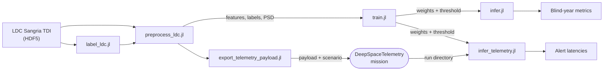
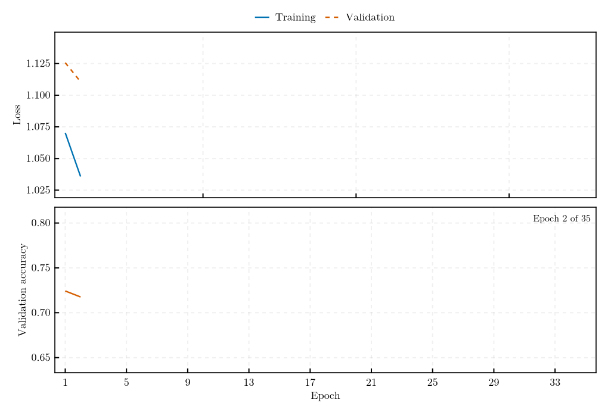
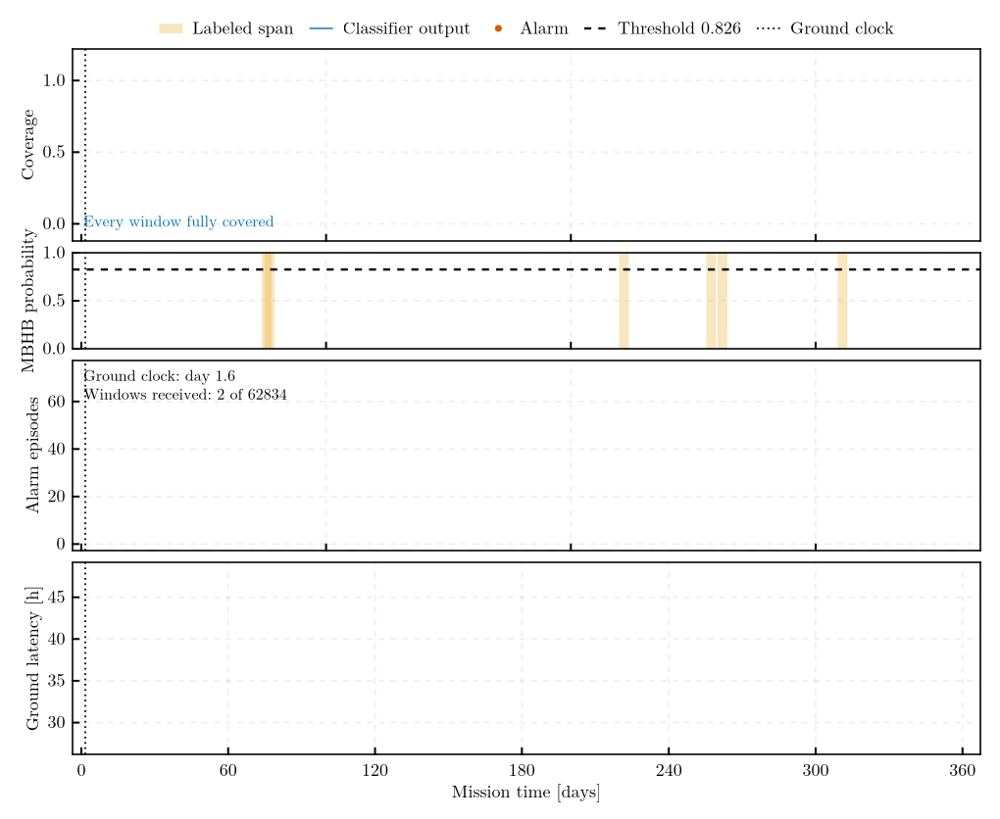

# MilliHertzQML.jl

[](https://github.com/PaulGoG/MilliHertzQML.jl/actions/workflows/CI.yml)
[](https://codecov.io/gh/PaulGoG/MilliHertzQML.jl)
[](https://PaulGoG.github.io/MilliHertzQML.jl/stable/)
[](https://github.com/PaulGoG/MilliHertzQML.jl/releases)
[](https://julialang.org/)
[](https://github.com/JuliaTesting/Aqua.jl)
[](LICENSE)

Quantum machine learning for gravitational-wave detection in the milliHertz band. A variational quantum classifier (VQC) with data re-uploading detects massive black hole binary (MBHB) coalescences in simulated LISA-like telemetry. Quantum circuits are simulated with `Yao.jl`; optimisation uses `Zygote.jl` gradients and `Flux.jl` optimisers. The classification approach follows Isfan et al., *Class. Quantum Grav.* **42** 225001 (2025), DOI: 10.1088/1361-6382/ae1787, replacing the original Python/Qiskit implementation with a Julia one.

## File structure

```
MilliHertzQML.jl/
├── activate.jl          # activates and instantiates the root environment
├── configs/             # default, Sangria, and experiment configurations
├── src/                 # package: physics, model, stages, telemetry coupling
├── ext/                 # CairoMakie, DeepSpaceTelemetry and CurvatureDistinguishability extensions
├── scripts/             # entry points, own environment
├── test/                # suite with static QA, own environment
├── bench/               # benchmarks, own environment
├── docs/                # Documenter manual, own environment
├── data/                # inputs and outputs (not tracked)
└── models/              # per-run model directories (not tracked)
```

The full tree is at the end of this page.

## Environment

The package is developed on Julia 1.13, the current stable release. `Manifest.toml` files are not
tracked; the environments resolve from `Project.toml` and its `[compat]`
bounds. The `[compat]` floor is 1.12; continuous integration runs the
suite on the floor and on the current release at every push. With
[juliaup](https://github.com/JuliaLang/juliaup), `juliaup update` keeps
the `release` channel current.

The package is not registered in the General registry and is not intended
to be. A downstream environment adds it by URL, pinned to a release tag,

```julia
using Pkg
Pkg.add(url = "https://github.com/PaulGoG/MilliHertzQML.jl", rev = "v1.1.0")
```

or consumes a clone by path — `Pkg.develop(path = ...)`, or a `[sources]`
entry. From a clone of this repository:

```bash
git clone https://github.com/PaulGoG/MilliHertzQML.jl.git
cd MilliHertzQML.jl
julia activate.jl
```

Every environment carries an `activate.jl` that activates and instantiates
it; `julia -i activate.jl` opens a session in the root environment, and
`julia -i test/activate.jl` (likewise `scripts/`, `docs/`, `bench/`) in an
auxiliary one.

The scripts, tests, benchmarks, and documentation each carry their own
environment (`scripts/`, `test/`, `bench/`, `docs/`) that consumes the
package by path and activates itself, so the step above is optional for
them; the first invocation of each environment resolves and precompiles
it. The script and test environments also pin the telemetry producer
[DeepSpaceTelemetry.jl](https://github.com/PaulGoG/DeepSpaceTelemetry.jl),
unregistered likewise, as a git source at the commit of a release tag (`v2.0.0`); its
[manual](https://PaulGoG.github.io/DeepSpaceTelemetry.jl/stable/)
documents the run directory this package reads. They pin
[CurvatureDistinguishability.jl](https://github.com/PaulGoG/CurvatureDistinguishability.jl)
the same way (`v2.0.1`), for the constellation response of the simulator. On a machine whose git
configuration rewrites GitHub URLs to SSH, instantiate them with
`JULIA_PKG_USE_CLI_GIT=true` so that the package manager uses the
command-line git client and its agent.

## Entry points

```bash
julia activate.jl                                   # instantiate the root environment
julia scripts/generate_data.jl configs/default.toml --run-id sim01
julia scripts/preprocess_ldc.jl configs/default.toml \
    --h5-file data/inputs/simulated_telemetry_complex.h5 \
    --label-file data/inputs/simulated_telemetry_complex_labels.csv \
    --output-prefix telemetry_sim
julia scripts/train.jl configs/default.toml --run-id <RUN_ID>
julia scripts/infer.jl configs/default.toml --run-id <RUN_ID> --block test
julia test/runtests.jl                              # static QA, unit tests, pipeline smoke test
julia bench/benchmarks.jl                           # performance measurements
julia docs/make.jl                                  # manual, written to docs/build/
```

The manual is deployed at
[PaulGoG.github.io/MilliHertzQML.jl/stable](https://PaulGoG.github.io/MilliHertzQML.jl/stable/)
from the release tags and at [`/dev`](https://PaulGoG.github.io/MilliHertzQML.jl/dev/)
from `main`.

## Component status

| Component | State |
|---|---|
| Core library (`src/`) | Functional; unit tests pass; fail-fast input validation on public interfaces |
| Pipeline architecture | Every stage a typed library function behind a thin dispatcher; TOML single source of truth validated on load; git and hardware provenance in every snapshot; overwrite-safe writes; produce-or-load feature products; memory guard from `[resources]`; stage-timing table |
| Telemetry simulator | Functional and seeded; Robson–Cornish–Liu (2019, DOI 10.1088/1361-6382/ab1101) noise at physical amplitude, IMRPhenomA (Ajith et al. 2008, DOI 10.1103/PhysRevD.77.104017) injections scaled to a matched-filter SNR, anchored on the coalescence sample, Nyquist-tapered by construction; optionally the A and E channels of the constellation through the CurvatureDistinguishability extension (antenna patterns on the orbits, Doppler phase, transfer roll-off, injections at physical amplitude for a drawn distance); no spins or higher modes |
| Feature extraction | PSD-whitened, amplitude- and window-length-independent features (two fixed bands, a configurable band partition, or the paper's raw-window set); whitening by the strain model, the LDC TDI model, or a Welch estimate; scaler fitted on the training partition and persisted with the model together with the phase-encoding span (`[0, π]` by default; earlier artifacts load on `[0, 2π]`) |
| LDC products | Native reader of the compound TDI datasets and catalogues; analytic TDI noise PSD reproducing the `ldc` package; truth-stream labels; validated against a reference matched-filter SNR anchor and a noise-only null test on Sangria; benchmarked on the blind year (`docs/src/benchmark.md`) |
| Training script | Chronological block split with a one-window buffer, class-weighted loss, batch gradients and forward passes over the Julia threads (one Zygote tape per chunk of samples, deterministic reduction), early stopping on the validation block, decision threshold fitted on the calibration block (`threshold_block`: the validation block by default, or validation and test pooled where a separate blind record exists, so that the fitted false-alarm rate rests on enough episodes to transfer), test block evaluated once with event-level metrics and the false-alarm rate per 30 days |
| Inference script | Applies the persisted threshold to any feature table or to one block of the training table; window- and event-level metrics with labels; blind mode without |
| Telemetry coupling | Payload export for DeepSpaceTelemetry; run-directory adapter over the producer's API (package extension); coverage, window scheduling, record-context streaming detector with static whitening or causal whitening by a trailing PSD estimated only from data already delivered to the ground station, replay and live modes, alert-latency table with a persistence criterion and its figure; integration test runs a producer mission in a temporary root; delivery holes excluded from scoring, outages, retransmission and generation gaps handled, the causal whitening estimate pooled over the delivered runs |
| Documentation | Tracks the current state, including the Sangria benchmark page with its figures and the limits of the result; the remaining deficiencies are listed on the physics and architecture pages |

The remaining deficiencies are documented in `docs/src/physics.md` and `docs/src/architecture.md`.

## Pipeline



The batch path trains and evaluates on a complete record; the streaming
path replays the same model against a telemetry mission, scoring each
window once its conditioning stretch (the interval of the record around
the window over which it is high-pass filtered and whitened) has reached
the ground. The threshold is
fitted once, in the batch path, and carried unchanged into both.

Every script takes the configuration file as its first argument (default `configs/default.toml`) and may be invoked from any working directory; relative paths resolve against the repository root. The TOML file is the single source of every parameter — physical and numerical settings, output roots under `[paths]`, memory thresholds under `[resources]`, RNG seeds — validated on load with the offending key named; the command line adds only a run identifier, a test-mode switch, a seed override, and the location of external inputs. Each run is assigned a run identifier under which models (JLD2), plots, logs, the per-epoch training history, and a configuration snapshot are stored.

## Usage

### Simulated telemetry

```bash
# 1. Simulate continuous telemetry (HDF5 strain + point-wise labels + event catalog)
julia scripts/generate_data.jl configs/default.toml --run-id sim01

# 2. Sliding-window feature extraction
julia scripts/preprocess_ldc.jl configs/default.toml \
    --h5-file data/inputs/simulated_telemetry_complex.h5 \
    --label-file data/inputs/simulated_telemetry_complex_labels.csv \
    --output-prefix telemetry_sim

# 3. Training: chronological train/validation/test blocks, class-weighted BCE,
#    early stopping on the validation block, threshold fitted on the calibration block
julia scripts/train.jl configs/default.toml --run-id <RUN_ID>

# 4. Inference and diagnostics with the persisted threshold (mission trace, ROC,
#    sensitivity versus SNR, score distributions); --block test restricts the
#    evaluation to the test block of the training table
julia scripts/infer.jl configs/default.toml --run-id <RUN_ID> --block test
```

Training converges in a few dozen epochs and stops on the validation
block; `scripts/animate.jl` renders the history and the streaming replay
as GIFs beside the static figures.



`--test-mode` restricts training to the first `test_mode_samples` windows and `test_mode_epochs` epochs (from `[training]`) for rapid validation. `--seed` overrides `[training] seed` for one run, for initialisation-variance studies; the override is recorded in the run's configuration snapshot, so that the seed of a run can be read from its own artifacts. Training and inference use every Julia thread of the session (`julia -t auto`, or `JULIA_NUM_THREADS`) for the batch gradients and the forward passes; `threaded = false` under `[training]` selects the serial path. Each stage is also a library function (`generate_telemetry`, `label_truth_stream`, `preprocess_record`, `train_classifier`, `evaluate_classifier`) taking the parsed configuration and returning its artifacts, for use from tests or other packages.

### Sangria products

For an LDC product (Sangria), the labels come from the truth stream instead of the simulator, and the whitening PSD is estimated from the record (`[preprocessing] psd = "welch"`) or taken from the LDC analytic TDI model (`"ldc"`). `configs/sangria.toml` holds the benchmark settings (`configs/sangria_paper.toml` the paper-parity variant); the HDF5 products are passed on the command line:

```bash
# Labels from the truth stream and catalog of the training product, then features
julia scripts/label_ldc.jl configs/sangria.toml \
    --h5-file <LDC2_sangria_training_v2.h5> --output-prefix sangria
julia scripts/preprocess_ldc.jl configs/sangria.toml \
    --h5-file <LDC2_sangria_training_v2.h5> \
    --label-file data/inputs/sangria_labels.csv --output-prefix sangria_train

# Blind set: point-wise labels from the unblinded MBHB-only TDI (columns t, X, Y, Z)
julia scripts/label_ldc.jl configs/sangria.toml \
    --truth-csv <mbhb_unbl.csv> --output-prefix sangria_blind_points
julia scripts/preprocess_ldc.jl configs/sangria.toml \
    --h5-file <LDC2_sangria_blind_v2.h5> \
    --label-file data/inputs/sangria_blind_points_labels.csv --output-prefix sangria_blind

# Training on the year-long training set, then the blind evaluation
julia scripts/train.jl configs/sangria.toml --run-id sangria01
julia scripts/infer.jl configs/sangria.toml --run-id sangria01
```

The validation anchors of the LDC reader and noise model run with the test suite when `MILLIHERTZQML_LDC_DIR` names the directory holding `LDC2_sangria_training_v2.h5`.

### Telemetry coupling

The coupling to the telemetry simulator DeepSpaceTelemetry.jl is file-based in both directions. Upstream, a product of this pipeline is exported as the producer's external payload (one `Amplitude` column at 0.2 Hz) with a scenario fragment carrying the geometry (50 s segments, ten per batch, so one batch equals one window step), the mission epoch, and the event catalogue as markers. Downstream, a producer run directory is replayed (or followed live) through the producer's own API: the consumer tracks the coverage of delivered rows, scores every window as soon as it is complete with the same conditioning as the batch pipeline, and reports the ground-availability latency of the first alarm of every event:

```bash
julia scripts/export_telemetry_payload.jl configs/default.toml \
    --h5-file data/inputs/simulated_telemetry_complex.h5 \
    --catalog data/inputs/simulated_telemetry_complex_events.csv --output-prefix mission01
# ... run DeepSpaceTelemetry on a scenario merged from data/inputs/mission01_scenario.toml ...
julia scripts/infer_telemetry.jl configs/default.toml --run-dir <DeepSpaceTelemetry run directory> \
    --model models/run_<RUN_ID>/gw_model.jld2 \
    --events data/inputs/simulated_telemetry_complex_events.csv --run-id coupling01
```

`infer_telemetry.jl` writes `telemetry_windows.csv` (one row per scored window with its completion time and inference wall time), `alert_latency.csv` (per event: first alarmed window, data latency, total latency with the ground processing budget, false-alarm episodes per 30 days), a snapshot, and the alert figure. The `[telemetry]` section of the configuration holds the geometry, the coverage and erosion policy, the accepted producer version, and the processing budget.

### Constellation response

The simulator records, by default, one strain referred to the sky-averaged sensitivity, with every source placed at a matched-filter SNR. With `response = "lisa"` in `[generation]` it records the A and E channels of the constellation instead — antenna patterns on the LISA orbits, orbital Doppler phase and transfer roll-off from CurvatureDistinguishability.jl, loaded as a package extension — with the MBHB injections at physical amplitude for a luminosity distance drawn from `[mbhb_distance_min_gpc, mbhb_distance_max_gpc]` and isotropic orientation, independent noise per channel at the Michelson-channel level, and labels on the channel named by `label_channel`. Such records are whitened with `psd = "channel"` (or `"welch"`) in `[preprocessing]`; the physics page of the manual states the conventions and their limits.

### Run artifacts

Every snapshot a stage writes carries the hardware fingerprint, the git description of the tree, and the package version; existing files are moved to `<stem>_#k<ext>` backups instead of being overwritten; preprocessing reuses a feature product whose parameters have not changed unless `--force` is given. Before allocating, a stage estimates its memory against `[resources]` and refuses to start above `max_memory_gib`. The scripts print the stage-timing table at the end.

Training writes `split.toml` (block ranges), `threshold.toml` (the threshold fitted on the calibration block of `threshold_block` by `threshold_criterion`: `far`, at most `target_far_per_30d` false-alarm episodes per 30 days and an alarm duty cycle of at most `target_fpr` on unlabelled windows, scanned from the highest threshold down so that the operating point stays on the branch of short, isolated episodes; `fpr`; or `youden`), `threshold_sweep.csv` (event and window recall and false-alarm rate of the calibration block at every candidate threshold, drawn as the `threshold_sweep` figure), and `metrics.toml` (window- and event-level metrics of the validation and test blocks) into the run directory. Inference applies the persisted threshold; with labels it writes `metrics.toml` and the post-hoc `threshold_sweep.csv` for the evaluated rows. Blind inference (`--labels ""`) produces per-window scores and decisions without labels.

### Figures

Figures are built on one layout (a 900 × 600 pt single panel that grows by 350 pt per stacked panel) under one theme (Computer Modern, 26 pt type, boxed axes, legend above the axes, Okabe–Ito colours, one colour per quantity) and exported by the scripts as vector PDF plus a 4× PNG with a provenance sidecar per figure (`<plots>/run_<id>/<figure>.{pdf,png,toml}`): the simulated trace with its whitened panel, the training history, the mission trace with the labelled spans and the threshold, the ROC curve, the detection sensitivity versus SNR, and the score distributions. The figure functions live in the package as a CairoMakie extension (`using CairoMakie` activates them), so the core library carries no plotting dependency.

## Results

### The Sangria blind year

On the LISA Data Challenge 2a "Sangria" blind year, the eight-qubit model
(`configs/experiments/q8_b6.toml`: 8 qubits, 4 re-uploading layers, six
sub-mHz band powers, run `q8_b6_pi`) detects **all five labelled MBHB
events at 1.57 false-alarm episodes per 30 mission days**, from a decision
threshold fitted on the pooled held-out block of the *training* year —
validation and test together, 110 days — and applied without adjustment;
the fit predicted 1.38. The configuration and seed were chosen on the
validation block of the training year by a selection rule fixed before the
blind year was scored, and the [benchmark page](docs/src/benchmark.md)
reports every run of the grid beside it.
The spread under re-initialisation alone ranges from 1.57 to 8.74 per 30
days across four seeds of the same configuration, and the single seed of
every other configuration lies inside that spread on the selection
statistic, so the ranking between configurations is not established. The
blind year is whitened by the full-record PSD, the median Welch estimate
of the entire blind year, which is available only after the whole record
has been received; this is admissible for a completed record and
non-causal for a streamed one.


Every run encodes its features on the half period ``[0, π]`` of the ``R_z`` gate, so that a feature saturated above the training range is encoded as a state distinct from the noise floor. The selected model exceeds the threshold in the merger bin of four of the six blind coalescences; the detection of the two most saturated rests on the inspiral excess of the preceding hours.

### Telemetry replay

Replayed through a simulated year-long telemetry mission with daily
ground-station passes and under causal whitening — the PSD estimated from
the delivered record behind each window and re-estimated daily — the same
model raises a sustained alert (two consecutive alarmed windows, a
persistence fixed on the calibration block of the training year) for five
of the six coalescences at 1.90 false-alarm episodes per 30 days, reaching
the ground station between 26 hours before and 42 hours after the merger;
event 2 is alarmed only within the cluster of alarms around the merger of
event 1. The two alerts that precede their merger are not evidence of a
detection of the inspiral: at this rate 1.3 chance episodes are expected
inside the label spans. Evaluated on
isolated alarms instead, the same replay alarms three coalescences 1.1 to
1.7 days before their merger at 5.94 per 30 days, which is consistent with
chance coincidence at that false-alarm rate. Whitened by the full-record
PSD, the replay reaches 1.32 per 30 days, with two alerts two to three
days before the merger on two-window inspiral runs that the causal
whitening does not produce; this replay is non-causal and is an upper
reference for the causal replay. The mission lost no data, and the
coupling excludes delivery holes from scoring rather than handling them.


The replay is also rendered as an animation: four panels traverse the year
in the order in which the ground station received the windows. The dotted
line is the ground-station clock; its distance from the edge of the
received data is the availability latency, the wait for the conditioning
stretch plus the downlink delay.



### The spread under re-initialisation

The selected configuration was trained at three further seeds inside the
same grid, each run refitting its own threshold. All four realisations
recover 5 of 5 events, two of the four remain below the requested three
per 30 days, and the delivered rate spans 1.57 to 8.74 while the ROC area
changes from 0.807 to 0.827 in the opposite direction. The recall is
stable; the false-alarm rate carries a factor-of-several uncertainty from
initialisation alone, and the seed with the lowest fitted threshold is the
one whose operating point does not transfer.


### Effect of a lossy link

Seventeen 30-day missions over the same payload window, each differing
from a lossless reference in one property of the channel or of the
spacecraft, were replayed with the selected model. Scattered permanent
loss is the property that reduces the scored record: a window is scored
only once its whole conditioning stretch of 410 consecutive batches has
reached the ground, so the scorable fraction falls as `(1 − p)^410` and
decreases rapidly beyond about 0.2 %; above that rate, whether a
coalescence is still detected depends on where the holes fall. The same
losses clustered in bursts preserve most of the record, three
retransmission attempts on a 3 % channel leave no hole, a link outage of
up to three days increases the latency without removing a single window,
and a gap in the data itself removes the stretch around it and the event
inside it.


### Smoothed whitening

The conditioning stretch of the selected configuration, twenty window
lengths on each side, is set by the long kernel of whitening with a raw
Welch estimate. `configs/experiments/q8_b6_s001.toml` smooths that estimate
by 0.01 dex in log-frequency and retrains the same model with the same
seed and threshold rule. Streamed and batch scores then agree from one
window length of context on (rank correlation 1.000), so the stretch falls
to two window lengths, 50 batches instead of 410, and the conditioning lag
from 1.16 days to 2.8 hours. In the batch benchmark the smoothed model
recovers the five label spans at 2.97 false-alarm episodes per 30 days,
within the spread the selected configuration shows under re-initialisation.

In the year-long replay under causal whitening, at the persistence of
three that the calibration rule gives for this model, five of the six
coalescences are alerted on their own, each 12 to 71 hours before its
merger in ground time, at two false-alarm episodes in the year (0.16 per
30 days); about 0.1 chance episodes are expected inside the label spans,
so these alerts are a detection of the inspiral. In the seventeen lossy
missions it alerts both coalescences in every mission at 0 to 2.5 false
alarms per 30 days, and at 0.42 % permanent loss it still scores 81 % of
the record, where the selected configuration scores 9 %. These results
rest on one initialisation seed.


### Against other methods

Compared with the published method, reproduced on the same years and
encoding with its own raw-periodogram features and four-qubit register
(`configs/sangria_paper.toml`), the band features reduce the false-alarm
rate from 31.7 to 1.57 episodes per 30 days and raise the score of the
highest-SNR merger from a margin of 0.002 above the threshold to well
above it. The paper reports no false-alarm rate. A classical multilayer
perceptron trained on the same challenge data detects all six
coalescences with no false alarm, with 29,569 parameters; the 64-parameter
circuit does not reach that result. The benchmark page reports this
together with the reasons the comparison is indicative rather than
decided: the baseline is quoted from the predictions released with it,
not reproduced, and both classifiers are evaluated on a record
renormalised towards the training one, the baseline through a refitted
scaler and this pipeline through the full-record PSD of the blind year.

## Limitations

- **One blind realisation of five events.** The recall is 5 of 5 and the
  false-alarm rate is measured over 364 days, but five events do not
  measure a detection efficiency. Read the recall as a result, not a rate.
- **Four initialisations, not a distribution.** The selected configuration
  was trained at four seeds: all recover 5 of 5 events, two of four remain
  below the requested rate, and the delivered false-alarm rate spans 1.57
  to 8.74 per 30 days. Read the recall as stable and the false-alarm rate
  as carrying a factor-of-several uncertainty from initialisation alone.
  The rest of the grid remains single-run at `seed = 9999`, inside that
  spread.
- **Single channel.** Only A is used. E and T carry independent
  information and would allow a null-channel veto.
- **Scattered permanent loss must stay below about 0.2 % for the selected
  configuration.** The coupling
  discards windows that cross a delivery hole instead of scoring them, and
  because a window needs its whole conditioning stretch of 410 batches,
  the scorable record decreases rapidly above that rate; outages,
  retransmitted loss, bursty loss and gaps in the data itself reduce it
  far less, and the causal whitening estimate pools the delivered runs
  around the holes. The classifier has never been trained on gapped data.
  The smoothed-whitening configuration `q8_b6_s001` shortens the stretch to
  50 batches and still scores 81 % of the record at 0.42 % loss.
- **The threshold comes from the same mission's earlier year.** A real
  chain would recalibrate as the mission proceeds; the transfer measured
  here spans one year, in one direction.
- **The encoding is mitigated, not solved.** On ``[0, π]`` a clamped
  feature is a state distinct from the floor, but every clamped feature is
  the same state whatever its magnitude; the two most saturated
  coalescences still score below the threshold in their merger bin.
- **The replay whitened by the full-record PSD is non-causal.** The replay
  latencies are quoted under causal whitening; the replay beside them,
  whitened by the full-record PSD, is an upper reference for the causal
  replay.

The physical and methodological deficiencies behind these — waveform and
noise-model scope, the single evaluation record — are listed in
[`docs/src/physics.md`](docs/src/physics.md) and
[`docs/src/architecture.md`](docs/src/architecture.md).

## Full file tree

<details>
<summary>Full file tree</summary>

```text
MilliHertzQML.jl/
├── activate.jl             # Activates and instantiates the root environment
├── src/
│   ├── MilliHertzQML.jl    # Module definition and exports
│   ├── config.jl           # TOML loading, validated key access, typed settings of every section, path resolution
│   ├── provenance.jl       # Run identifiers, hardware and git provenance, overwrite-safe writing, memory guard, stage timer
│   ├── stages/             # One typed stage function per pipeline step
│   │   ├── generation.jl   #   generate_telemetry: simulated continuous telemetry, labels, event catalog
│   │   ├── labeling.jl     #   label_truth_stream: point-wise MBHB labels of an LDC product
│   │   ├── export_payload.jl #  export_telemetry_payload: A-channel payload and scenario fragment for the telemetry producer
│   │   ├── preprocessing.jl #  preprocess_record: whitening and window features with produce-or-load semantics
│   │   ├── training.jl     #   train_classifier: chronological blocks, training, threshold fitted on the calibration block
│   │   └── inference.jl    #   evaluate_classifier: scoring, event-level metrics
│   ├── model.jl            # VQC struct, ansatz and feature-map construction
│   ├── training.jl         # Forward pass, class-weighted BCE loss, gradient step
│   ├── evaluation.jl       # Chronological block split, ROC, calibration-block threshold, event-level metrics
│   ├── simulation.jl       # Noise model (Robson–Cornish–Liu 2019), synthesis, matched-filter SNR, whitening
│   ├── waveforms.jl        # IMRPhenomA inspiral–merger–ringdown waveform on the sampling grid
│   ├── response.jl         # Detector-response interface of the simulator: sky-averaged response and the constellation hook the extension implements
│   ├── data.jl             # Window features (whitened set, paper set), train-fitted feature scaler, CSV loading
│   ├── ldc.jl              # LDC TDI noise PSD, compound HDF5 readers, A/E/T, Welch PSD, truth-stream labeling
│   ├── visualization.jl    # Figure interface (theme, export with provenance, one function per figure)
│   ├── telemetry.jl        # Telemetry coupling: run interface, coverage, window scheduler, streaming detector, replay, alert latency
│   └── persistence.jl      # JLD2 model save/load (parameters, hyperparameters, feature scaler)
├── ext/
│   ├── MilliHertzQMLCairoMakieExt.jl        # CairoMakie implementation of the figures (loads with CairoMakie)
│   ├── MilliHertzQMLCurvatureDistinguishabilityExt.jl # Constellation response of the simulator (loads with CurvatureDistinguishability)
│   └── MilliHertzQMLDeepSpaceTelemetryExt.jl # Run-directory adapter over the DeepSpaceTelemetry API (loads with DeepSpaceTelemetry)
├── scripts/
│   ├── Project.toml        # Script environment (package by path, the two producers by git)
│   ├── activate.jl         # Activates and instantiates this environment
│   ├── common.jl           # Activation of the script environment
│   ├── generate_data.jl    # Dispatcher of generate_telemetry plus the trace figure
│   ├── label_ldc.jl        # Dispatcher of label_truth_stream
│   ├── preprocess_ldc.jl   # Dispatcher of preprocess_record
│   ├── train.jl            # Dispatcher of train_classifier plus the terminal dashboard, file logger, and training figure
│   ├── infer.jl            # Dispatcher of evaluate_classifier plus the diagnostic figures
│   ├── export_telemetry_payload.jl  # Payload CSV and scenario fragment for a DeepSpaceTelemetry mission
│   ├── infer_telemetry.jl  # Replay or follow a DeepSpaceTelemetry run: scored windows, alert latencies, figure
│   └── animate.jl          # GIF of a training history or of a telemetry replay, with a provenance sidecar
├── test/
│   ├── Project.toml        # Test environment (package by path, the two producers by git)
│   ├── activate.jl         # Activates and instantiates this environment
│   ├── runtests.jl         # Static QA (Aqua, JET, ExplicitImports), unit tests, pipeline smoke test
│   ├── telemetry_tests.jl  # Coupling core on an in-memory run
│   ├── telemetry_integration_tests.jl  # A DeepSpaceTelemetry mission replayed through the extension
│   ├── response_tests.jl   # Constellation response extension: patterns, channel PSD, catalog, A/E record
│   └── export_payload_tests.jl         # Payload export stage
├── bench/
│   ├── Project.toml        # Benchmark environment (package consumed by path)
│   ├── activate.jl         # Activates and instantiates this environment
│   └── benchmarks.jl       # BenchmarkTools performance measurements
├── docs/
│   ├── Project.toml        # Documentation environment (package consumed by path)
│   ├── activate.jl         # Activates and instantiates this environment
│   ├── make.jl             # Documenter.jl build script
│   └── src/                # Manual pages incl. the Sangria benchmark and its figures (build/ is generated, not tracked)
├── data/
│   ├── inputs/             # Generated telemetry and feature CSVs (not tracked)
│   └── outputs/            # Per-run plots and results (not tracked)
├── models/                 # Per-run model checkpoints (not tracked)
├── .github/
│   ├── workflows/CI.yml    # Test suite on the compat floor and the current release, formatting check, coverage
│   ├── workflows/Documentation.yml  # Manual built on every push and deployed to GitHub Pages
│   └── dependabot.yml      # Weekly updates of the Julia and GitHub Actions dependencies
├── .JuliaFormatter.toml    # Committed formatter configuration
├── CHANGELOG.md            # Notable changes (Keep a Changelog format)
├── CITATION.cff            # Citation metadata
├── LICENSE                 # MIT
├── configs/
│   ├── default.toml        # Pipeline defaults (simulator)
│   ├── sangria.toml        # Sangria benchmark: Welch-whitened features, truth-stream labels
│   ├── sangria_paper.toml  # Sangria paper-parity run: raw-window feature set of Isfan et al. (2025)
│   └── experiments/        # Sangria capacity experiments: one configuration per model width, depth, band partition, and whitening variant
└── Project.toml            # Package metadata: only the dependencies of src/
```

</details>

## How to cite

Cite the software through `CITATION.cff`, or with:

```bibtex
@software{Gogita_MilliHertzQML,
  author  = {Gogîță, Paul-Adrian},
  title   = {MilliHertzQML.jl},
  version = {1.1.0},
  year    = {2026},
  url     = {https://github.com/PaulGoG/MilliHertzQML.jl}
}
```

## License

MIT — see `LICENSE`.
