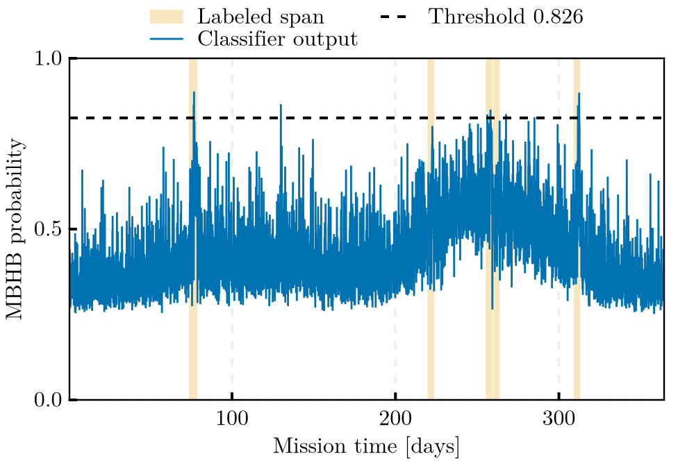

# MilliHertzQML.jl

Quantum machine learning for gravitational-wave detection in the milliHertz band. A variational quantum classifier (VQC) with data re-uploading detects massive black hole binary (MBHB) coalescences in simulated LISA-like telemetry. Quantum circuits are simulated with `Yao.jl`; optimization uses `Zygote.jl` gradients and `Flux.jl` optimizers. The classification approach follows Isfan et al., *Class. Quantum Grav.* **42** 225001 (2025), DOI: 10.1088/1361-6382/ae1787, replacing the original Python/Qiskit implementation with a Julia one.

## File Structure

```text
MilliHertzQML/
├── src/
│   ├── MilliHertzQML.jl    # Module definition and exports
│   ├── config.jl           # TOML loading, validated key access, typed settings of every section, path resolution
│   ├── provenance.jl       # Run identifiers, hardware and git provenance, overwrite-safe writing, memory guard, stage timer
│   ├── stages/             # One typed stage function per pipeline step
│   │   ├── generation.jl   #   generate_telemetry: simulated continuous telemetry, labels, event catalog
│   │   ├── labeling.jl     #   label_truth_stream: point-wise MBHB labels of an LDC product
│   │   ├── export_payload.jl #  export_telemetry_payload: A-channel payload and scenario fragment for the telemetry producer
│   │   ├── preprocessing.jl #  preprocess_record: whitening and window features with produce-or-load semantics
│   │   ├── training.jl     #   train_classifier: chronological blocks, training, threshold fitted on the calibration block
│   │   └── inference.jl    #   evaluate_classifier: scoring, event-level metrics
│   ├── model.jl            # VQC struct, ansatz and feature-map construction
│   ├── training.jl         # Forward pass, class-weighted BCE loss, gradient step
│   ├── evaluation.jl       # Chronological block split, ROC, calibration-block threshold, event-level metrics
│   ├── simulation.jl       # Noise model (Robson–Cornish–Liu 2019), synthesis, matched-filter SNR, whitening
│   ├── waveforms.jl        # IMRPhenomA inspiral–merger–ringdown waveform on the sampling grid
│   ├── data.jl             # Window features (whitened set, paper set), train-fitted feature scaler, CSV loading
│   ├── ldc.jl              # LDC TDI noise PSD, compound HDF5 readers, A/E/T, Welch PSD, truth-stream labeling
│   ├── visualization.jl    # Figure interface (theme, export with provenance, one function per figure)
│   ├── telemetry.jl        # Telemetry coupling: run interface, coverage, window scheduler, streaming detector, replay, alert latency
│   └── persistence.jl      # JLD2 model save/load (parameters, hyperparameters, feature scaler)
├── ext/
│   ├── MilliHertzQMLCairoMakieExt.jl        # CairoMakie implementation of the figures (loads with CairoMakie)
│   └── MilliHertzQMLDeepSpaceTelemetryExt.jl # Run-directory adapter over the DeepSpaceTelemetry API (loads with DeepSpaceTelemetry)
├── scripts/
│   ├── Project.toml        # Script environment (package consumed by path); Manifest committed
│   ├── common.jl           # Activation of the script environment
│   ├── generate_data.jl    # Dispatcher of generate_telemetry plus the trace figure
│   ├── label_ldc.jl        # Dispatcher of label_truth_stream
│   ├── preprocess_ldc.jl   # Dispatcher of preprocess_record
│   ├── train.jl            # Dispatcher of train_classifier plus the terminal dashboard, file logger, and training figure
│   ├── infer.jl            # Dispatcher of evaluate_classifier plus the diagnostic figures
│   ├── export_telemetry_payload.jl  # Payload CSV and scenario fragment for a DeepSpaceTelemetry mission
│   └── infer_telemetry.jl  # Replay or follow a DeepSpaceTelemetry run: scored windows, alert latencies, figure
├── test/
│   ├── Project.toml        # Test environment (package and producer consumed by path/git); Manifest committed
│   ├── runtests.jl         # Static QA (Aqua, JET, ExplicitImports), unit tests, pipeline smoke test
│   ├── telemetry_tests.jl  # Coupling core on an in-memory run
│   ├── telemetry_integration_tests.jl  # A DeepSpaceTelemetry mission replayed through the extension
│   └── export_payload_tests.jl         # Payload export stage
├── bench/
│   ├── Project.toml        # Benchmark environment (package consumed by path); Manifest committed
│   └── benchmarks.jl       # BenchmarkTools performance measurements
├── docs/
│   ├── Project.toml        # Documentation environment (package consumed by path)
│   ├── make.jl             # Documenter.jl build script
│   └── src/                # Manual pages incl. the Sangria benchmark and its figures (build/ is generated, not tracked)
├── data/
│   ├── inputs/             # Generated telemetry and feature CSVs (not tracked)
│   └── outputs/            # Per-run plots and results (not tracked)
├── models/                 # Per-run model checkpoints (not tracked)
├── .github/workflows/CI.yml # Test matrix, formatting check, documentation build (manual dispatch until the repository is public)
├── .JuliaFormatter.toml    # Committed formatter configuration
├── CHANGELOG.md            # Notable changes (Keep a Changelog format)
├── CITATION.cff            # Citation metadata
├── config.toml             # Pipeline defaults (simulator); overridden by CLI flags
├── config_sangria.toml     # Sangria benchmark: Welch-whitened features, truth-stream labels
├── config_sangria_paper.toml # Sangria paper-parity run: raw-window feature set of Isfan et al. (2025)
├── configs/experiments/    # Sangria capacity experiments: one configuration per model width, depth, and band partition
├── Project.toml            # Package metadata: only the dependencies of src/
└── Manifest.toml           # Pinned dependency versions (tracked)
```

## Installation

Julia 1.13 is the development release: the committed `Manifest.toml` files
are resolved on it. The `[compat]` floor is 1.12, where the suite last
passed on 2026-09-10; the floor is retained until continuous integration
exercises it again. With [juliaup](https://github.com/JuliaLang/juliaup),
`juliaup update` keeps the `release` channel current.

The package is not registered in the General registry and is not intended
to be: it is used from a clone, and a downstream environment consumes it by
path or by git source — `Pkg.develop(path = ...)`, or a `[sources]` entry
pinning the URL and a revision — with released states marked by git tags.
From a clone of this repository:

```bash
git clone git@github.com:PaulGoG/MilliHertzQML.jl.git
cd MilliHertzQML.jl
julia --project -e 'using Pkg; Pkg.instantiate()'
```

The scripts, tests, benchmarks, and documentation each carry their own
environment (`scripts/`, `test/`, `bench/`, `docs/`) that consumes the
package by path and activates itself, so the step above is optional for
them; the first invocation of each environment resolves and precompiles
it. The script and test environments also pin the telemetry producer
[DeepSpaceTelemetry.jl](https://github.com/PaulGoG/DeepSpaceTelemetry.jl),
unregistered likewise, as a git source at a release commit; its
[manual](https://PaulGoG.github.io/DeepSpaceTelemetry.jl/stable/)
documents the run directory this package reads. On a machine whose git
configuration rewrites GitHub URLs to SSH, instantiate them with
`JULIA_PKG_USE_CLI_GIT=true` so that the package manager uses the
command-line git client and its agent.

## Usage

Every script takes the configuration file as its first argument (default `config.toml` at the repository root) and may be invoked from any working directory; relative paths resolve against the repository root. The TOML file is the single source of every parameter — physical and numerical settings, output roots under `[paths]`, memory thresholds under `[resources]`, RNG seeds — validated on load with the offending key named; the command line adds only a run identifier, a test-mode switch, a seed override, and the location of external inputs. Each run is assigned a run identifier under which models (JLD2), plots, logs, the per-epoch training history, and a configuration snapshot are stored.

```bash
# 1. Simulate continuous telemetry (HDF5 strain + point-wise labels + event catalog)
julia scripts/generate_data.jl config.toml --run-id sim01

# 2. Sliding-window feature extraction
julia scripts/preprocess_ldc.jl config.toml \
    --h5-file data/inputs/simulated_telemetry_complex.h5 \
    --label-file data/inputs/simulated_telemetry_complex_labels.csv \
    --output-prefix telemetry_sim

# 3. Training: chronological train/validation/test blocks, class-weighted BCE,
#    early stopping on the validation block, threshold fitted on the calibration block
julia scripts/train.jl config.toml --run-id <RUN_ID>

# 4. Inference and diagnostics with the persisted threshold (mission trace, ROC,
#    sensitivity versus SNR, score distributions); --block test restricts the
#    evaluation to the test block of the training table
julia scripts/infer.jl config.toml --run-id <RUN_ID> --block test
```

`--test-mode` restricts training to the first `test_mode_samples` windows and `test_mode_epochs` epochs (from `[training]`) for rapid validation. `--seed` overrides `[training] seed` for one run, for initialization-variance studies; the override lands in the run's configuration snapshot, so the seed a run used is read off its own artifacts. Training and inference use every Julia thread of the session (`julia -t auto`, or `JULIA_NUM_THREADS`) for the batch gradients and the forward passes; `threaded = false` under `[training]` selects the serial path. Each stage is also a library function (`generate_telemetry`, `label_truth_stream`, `preprocess_record`, `train_classifier`, `evaluate_classifier`) taking the parsed configuration and returning its artifacts, for use from tests or other packages.

Every snapshot a stage writes carries the hardware fingerprint, the git description of the tree, and the package version; existing files are moved to `<stem>_#k<ext>` backups instead of being overwritten; preprocessing reuses a feature product whose parameters have not changed unless `--force` is given. Before allocating, a stage estimates its memory against `[resources]` and refuses to start above `max_memory_gib`. The scripts print the stage-timing table at the end.

Figures are designed at the 86 mm single-column width under one theme (Computer Modern, boxed axes, legend above the axes, Okabe–Ito colors) and exported by the scripts as vector PDF plus a 4× PNG with a provenance sidecar per figure (`<plots>/run_<id>/<figure>.{pdf,png,toml}`): the simulated trace with its whitened panel, the training history, the mission trace with the labeled spans and the threshold, the ROC curve, the detection sensitivity versus SNR, and the score distributions. The figure functions live in the package as a CairoMakie extension (`using CairoMakie` activates them), so the core library carries no plotting dependency.

For an LDC product (Sangria), the labels come from the truth stream instead of the simulator, and the whitening PSD is estimated from the record (`[preprocessing] psd = "welch"`) or taken from the LDC analytic TDI model (`"ldc"`). `config_sangria.toml` holds the benchmark settings (`config_sangria_paper.toml` the paper-parity variant); the HDF5 products are passed on the command line:

```bash
# Labels from the truth stream and catalog of the training product, then features
julia scripts/label_ldc.jl config_sangria.toml \
    --h5-file <LDC2_sangria_training_v2.h5> --output-prefix sangria
julia scripts/preprocess_ldc.jl config_sangria.toml \
    --h5-file <LDC2_sangria_training_v2.h5> \
    --label-file data/inputs/sangria_labels.csv --output-prefix sangria_train

# Blind set: point-wise labels from the unblinded MBHB-only TDI (columns t, X, Y, Z)
julia scripts/label_ldc.jl config_sangria.toml \
    --truth-csv <mbhb_unbl.csv> --output-prefix sangria_blind_points
julia scripts/preprocess_ldc.jl config_sangria.toml \
    --h5-file <LDC2_sangria_blind_v2.h5> \
    --label-file data/inputs/sangria_blind_points_labels.csv --output-prefix sangria_blind

# Training on the year-long training set, then the blind evaluation
julia scripts/train.jl config_sangria.toml --run-id sangria01
julia scripts/infer.jl config_sangria.toml --run-id sangria01
```

The validation anchors of the LDC reader and noise model run with the test suite when `MILLIHERTZQML_LDC_DIR` names the directory holding `LDC2_sangria_training_v2.h5`.

The coupling to the telemetry simulator DeepSpaceTelemetry.jl is file-based in both directions. Upstream, a product of this pipeline is exported as the producer's external payload (one `Amplitude` column at 0.2 Hz) with a scenario fragment carrying the geometry (50 s segments, ten per batch, so one batch equals one window step), the mission epoch, and the event catalog as markers. Downstream, a producer run directory is replayed (or followed live) through the producer's own API: the consumer tracks the coverage of delivered rows, scores every window as soon as it is complete with the same conditioning as the batch pipeline, and reports the ground-availability latency of the first alarm of every event:

```bash
julia scripts/export_telemetry_payload.jl config.toml \
    --h5-file data/inputs/simulated_telemetry_complex.h5 \
    --catalog data/inputs/simulated_telemetry_complex_events.csv --output-prefix mission01
# ... run DeepSpaceTelemetry on a scenario merged from data/inputs/mission01_scenario.toml ...
julia scripts/infer_telemetry.jl config.toml --run-dir <DeepSpaceTelemetry run directory> \
    --model models/run_<RUN_ID>/gw_model.jld2 \
    --events data/inputs/simulated_telemetry_complex_events.csv --run-id coupling01
```

`infer_telemetry.jl` writes `telemetry_windows.csv` (one row per scored window with its completion time and inference wall time), `alert_latency.csv` (per event: first alarmed window, data latency, total latency with the ground processing budget, false-alarm episodes per 30 days), a snapshot, and the alert figure. The `[telemetry]` section of the configuration holds the geometry, the coverage and erosion policy, the accepted producer version, and the processing budget.

Training writes `split.toml` (block ranges), `threshold.toml` (the threshold fitted on the calibration block of `threshold_block` by `threshold_criterion`: `far`, at most `target_far_per_30d` false-alarm episodes per 30 days and an alarm duty cycle of at most `target_fpr` on unlabeled windows, scanned from the highest threshold down so that the operating point stays on the branch of short, isolated episodes; `fpr`; or `youden`), `threshold_sweep.csv` (event and window recall and false-alarm rate of the calibration block at every candidate threshold, drawn as the `threshold_sweep` figure), and `metrics.toml` (window- and event-level metrics of the validation and test blocks) into the run directory. Inference applies the persisted threshold; with labels it writes `metrics.toml` and the post-hoc `threshold_sweep.csv` for the evaluated rows. Blind inference (`--labels ""`) produces per-window scores and decisions without labels.

## Results

On the LISA Data Challenge 2a "Sangria" blind year, the eight-qubit model
(`configs/experiments/q8_b6.toml`: 8 qubits, 4 re-uploading layers, six
sub-mHz band powers) detects **all five labelled MBHB events at 2.47
false-alarm episodes per 30 mission days**, from a decision threshold
fitted on the pooled held-out block of the *training* year — validation
and test together, 110 days — and applied without adjustment; the fit
predicted 2.20. The blind year carries six catalogued coalescences, two of
them within a day of each other and so covered by one label span, which is
why the batch metrics count five events and the telemetry table six.
Replayed through a simulated year-long telemetry mission with daily
ground-station passes, the same model detects all six at 2.56 per 30 days.
**Four of the alerts precede their merger by 1.9 to 2.7 days**, the
classifier firing on the inspiral; a fifth arrives nineteen minutes before
its merger and, with the one-hour processing budget, forty minutes after
it; the sixth fifteen hours after. That mission lost no data, and the
coupling excludes delivery holes from scoring rather than handling them.



Two results of the benchmark are worth more than the numbers. The ROC area
ranks the seven models tried in almost the opposite order to their
delivered false-alarm rate, because the two observation years' noise
distributions agree only in the far tail and an operating point placed
below it inherits the annual modulation of the Galactic foreground. And
the conditioning is not causal: the whitening is zero-phase, so a window
scored the moment its samples arrive finds two of five events, and an
alert carries an irreducible look-ahead of 1.16 days. Both are set out,
with the evidence, in the [benchmark page](docs/src/benchmark.md), which
also states where a 14.6 k-parameter classical baseline does better.

## Limitations

- **One blind realisation of five events.** The recall is 5 of 5 and the
  false-alarm rate is measured over 364 days, but five events do not
  measure a detection efficiency. Read the recall as a result, not a rate.
- **One initialisation.** Every experiment runs at `seed = 9999`; the
  spread of the operating point under re-initialisation has not been
  measured.
- **Single channel.** Only A is used. E and T carry independent
  information and would allow a null-channel veto.
- **No gaps.** The Sangria products are gapless and the mission replayed
  here lost no data. The coupling discards windows that cross a delivery
  hole instead of scoring them, and the classifier has never been trained
  on gapped data; gap-tolerant features are planned, not implemented.
- **The threshold comes from the same mission's earlier year.** A real
  chain would recalibrate as the mission proceeds; the transfer measured
  here spans one year, in one direction.

The physical and methodological deficiencies behind these — waveform and
noise-model scope, the single evaluation record — are listed in
[`docs/src/physics.md`](docs/src/physics.md) and
[`docs/src/architecture.md`](docs/src/architecture.md).

## Testing and Benchmarks

```bash
julia --project -e 'using Pkg; Pkg.test()'   # static QA, unit tests, pipeline smoke test (equivalently: julia test/runtests.jl)
julia bench/benchmarks.jl                    # performance measurements
```

Documentation builds with Documenter.jl (`docs/make.jl` activates its own environment):

```bash
julia docs/make.jl
# open docs/build/index.html
```

## Component Status

| Component | State |
|---|---|
| Core library (`src/`) | Functional; unit tests pass; fail-fast input validation on public interfaces |
| Pipeline architecture | Every stage a typed library function behind a thin dispatcher; TOML single source of truth validated on load; git and hardware provenance in every snapshot; overwrite-safe writes; produce-or-load feature products; memory guard from `[resources]`; stage-timing table |
| Telemetry simulator | Functional and seeded; Robson–Cornish–Liu (2019) noise at physical amplitude, IMRPhenomA (Ajith et al. 2008) injections scaled to a matched-filter SNR, anchored on the coalescence sample, Nyquist-tapered by construction; no spins, higher modes, or LISA response |
| Feature extraction | PSD-whitened, amplitude- and window-length-independent features (two fixed bands, a configurable band partition, or the paper's raw-window set); whitening by the strain model, the LDC TDI model, or a Welch estimate; scaler fitted on the training partition and persisted with the model |
| LDC products | Native reader of the compound TDI datasets and catalogs; analytic TDI noise PSD reproducing the `ldc` package; truth-stream labels; validated against the School-notebook SNR anchor and a noise-only null test on Sangria; benchmarked on the blind year (`docs/src/benchmark.md`) |
| Training script | Chronological block split with a one-window buffer, class-weighted loss, batch gradients and forward passes over the Julia threads (one tape per sample, deterministic reduction), early stopping on the validation block, decision threshold fitted on the calibration block (`threshold_block`: the validation block, or validation and test pooled by default so that the fitted false-alarm rate rests on enough episodes to transfer), test block evaluated once with event-level metrics and the false-alarm rate per 30 days |
| Inference script | Applies the persisted threshold to any feature table or to one block of the training table; window- and event-level metrics with labels; blind mode without |
| Telemetry coupling | Payload export for DeepSpaceTelemetry; run-directory adapter over the producer's API (package extension); coverage, window scheduling, record-context streaming detector, replay and live modes, alert-latency table and figure; integration test runs a producer mission in a temporary root; gap-less delivery only (holes are excluded, not scored) |
| Documentation | Tracks the current state, including the Sangria benchmark page with its figures and the limits of the result; remediation of the remaining defects is planned |

Version 0.1.x is a pre-release: the remaining deficiencies are documented in `docs/src/physics.md` and `docs/src/architecture.md` and scheduled for remediation before any science use.

## License

MIT — see `LICENSE`.
