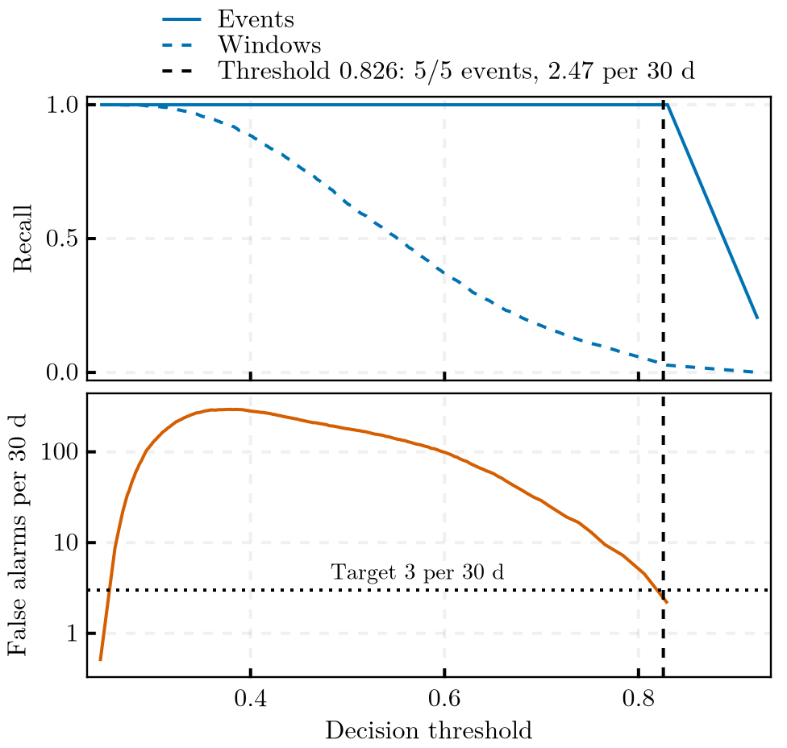
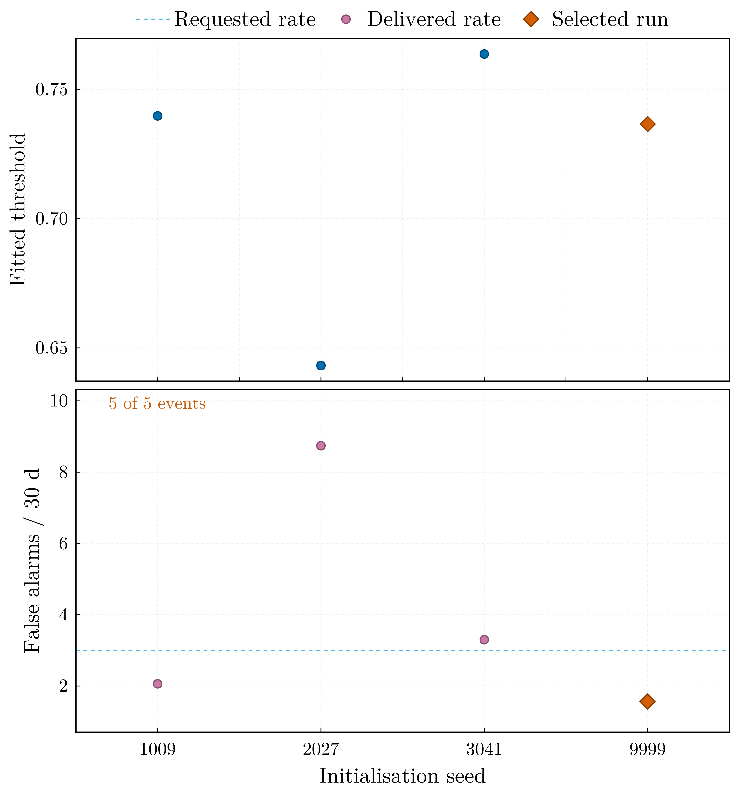
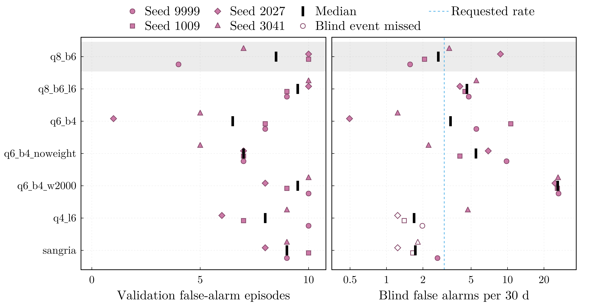
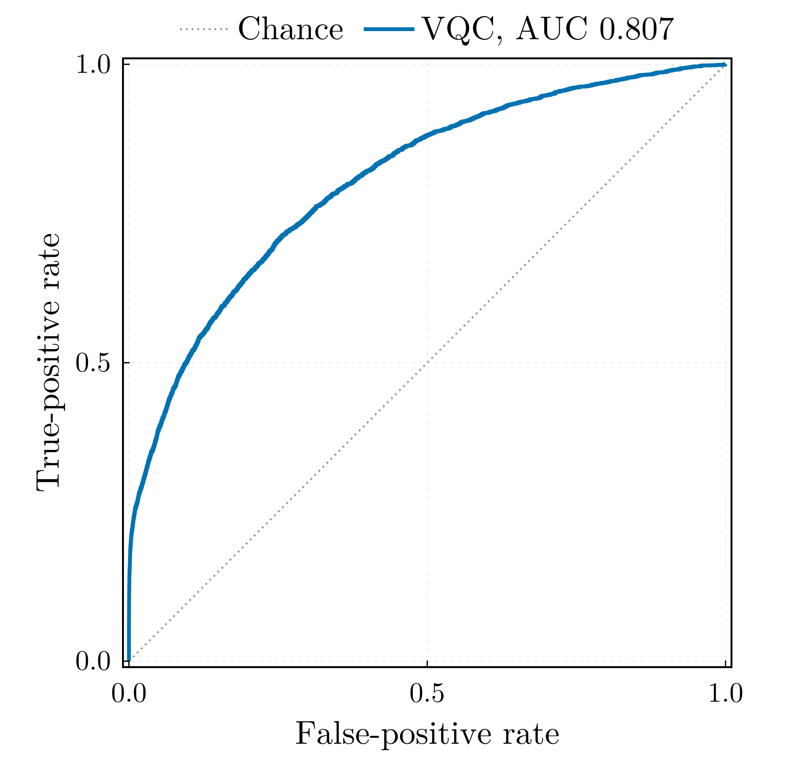
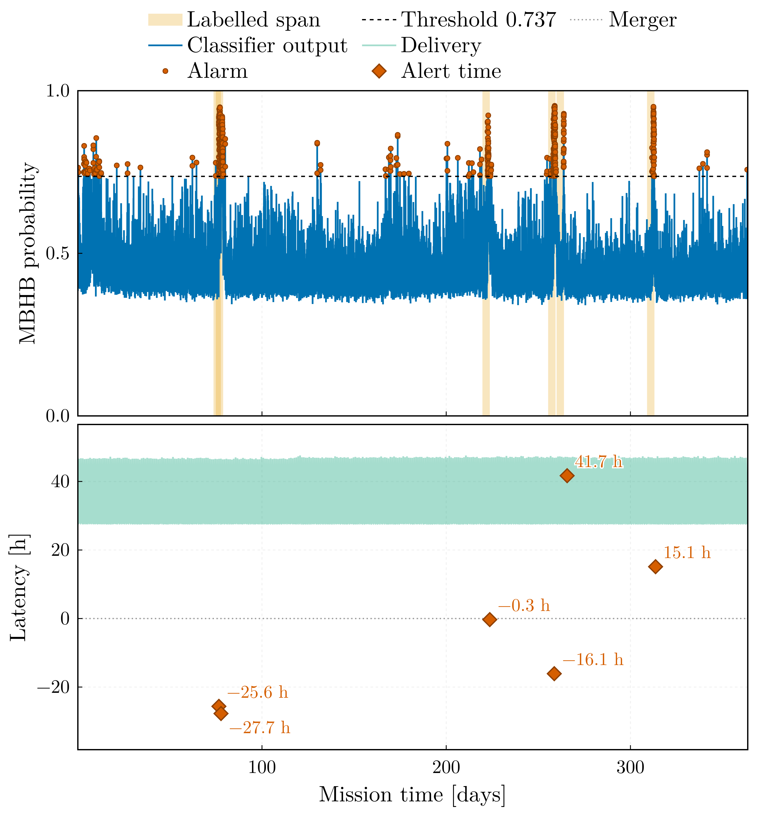
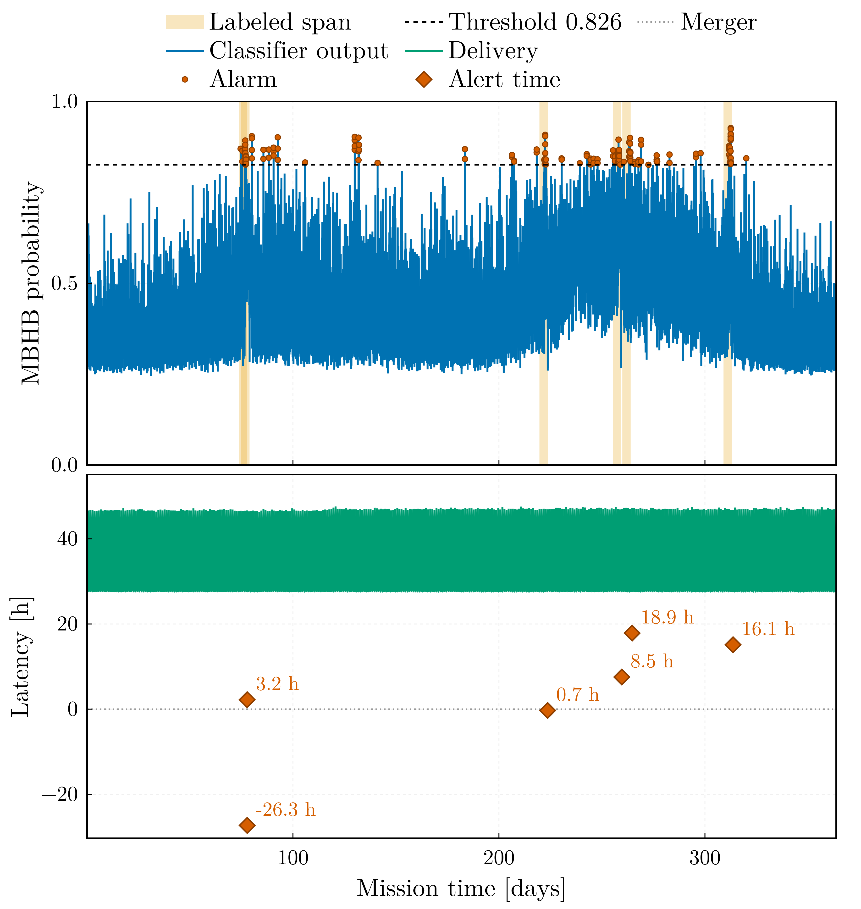
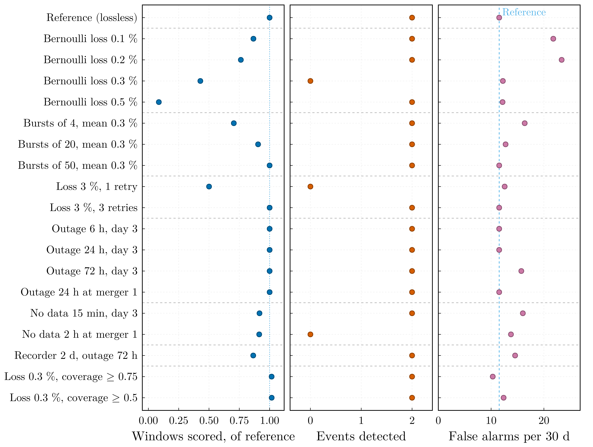
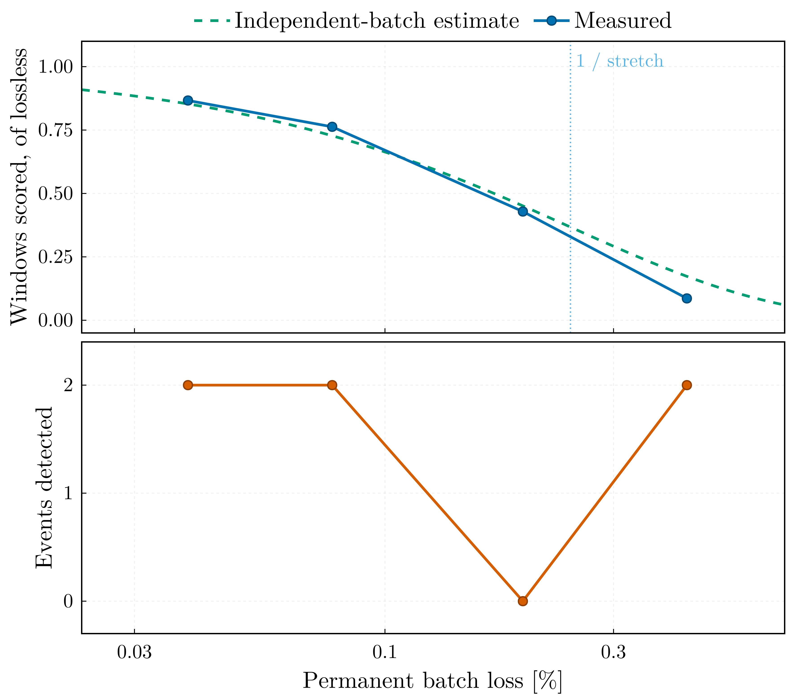
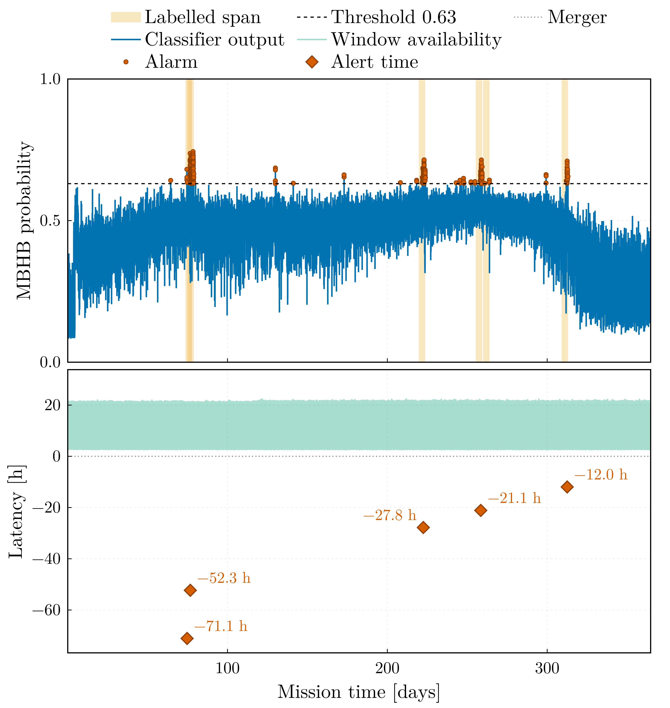

# Sangria benchmark

This page reports the results of the classifier on the LISA Data Challenge
2a "Sangria" data set: one year of simulated LISA telemetry for training
and a second, blind year for evaluation. The blind year is scored twice:
as a completed record, and streamed through a simulated telemetry mission
in which every window is scored once the data around it has reached the
ground.

| | Selected configuration, `q8_b6` | Streaming configuration, `q8_b6_s001` |
|---|---|---|
| Completed blind year: label spans, false alarms per 30 d | 5 of 5, **1.57** | 5 of 5, 2.97 |
| Streamed year, causal whitening: coalescences alerted before the merger | none; all six after it | **5 of 6** (6 of 6 at three further seeds) |
| Alert time at the ground station | 0.1 to 42 h after the merger | **11 to 24 h before** |
| Streamed year: false alarms per 30 d | 0.99 | **0.49** (1.15 to 1.56 at the further seeds) |
| Conditioning lag of every alert | 1.16 days | **2.8 hours** |
| Record scored at 0.43 % scattered batch loss | 9 % | **81 %** |

The selected configuration, eight qubits, four re-uploading layers and six
sub-mHz band powers, was chosen on the training year by a rule fixed before
the blind year was scored. On the completed blind year it detects all five
labelled events at 1.57 false-alarm episodes per 30 mission days (19
episodes over 364 days), from a decision threshold fitted on held-out data
of the training year and applied without adjustment; the fit predicted
1.38, so the operating point transfers. Trained at four seeds, the configurations with
four or six sub-mHz bands recover all five events in every run, the
two-band ones in two of eight; apart from 2000-sample windows, their
false-alarm rates do not differ beyond the scatter between seeds, which
for the selected configuration spans 1.57 to 8.74 per 30 days.

The completed record is whitened by its full-record PSD, the median Welch
estimate of the entire blind year: a label-free statistic, admissible for a
completed record but available only after the whole record has been
received. The streamed results are therefore quoted under causal
whitening, in which the PSD is estimated only from data already delivered
to the ground station; the stream whitened by the full-record PSD is
reported beside it as an upper reference.

Smoothing the Welch estimate in log-frequency shortens the kernel of the
whitening filter and with it the stretch of data every window needs. The
model retrained on smoothed features, `q8_b6_s001`, is the streaming
configuration: at each of four initialisation seeds it alerts five or six
of the six coalescences before their merger in the causal stream, and it
keeps scoring on a link that loses data. An alert is credited to a
coalescence only from its signal onset, the first window in which its
signal reaches a matched-filter SNR of 5; release 1.2.0 credited the whole
four-day label span, and the correction is given under [Telemetry replay
and alert latency](#Telemetry-replay-and-alert-latency). Every run on this
page encodes its features on the half period ``[0, \pi]`` of the ``R_z``
gate (see the encoding paragraph of the protocol).

## Data and labels

LDC2a Sangria provides two one-year records of TDI ``X``, ``Y``, ``Z`` at
0.2 Hz: a training product with its source catalogue and truth streams, and
a blind product whose MBHB catalogue is released separately. Both are read
natively (`read_tdi`, `read_catalog`) and reduced to the noise-orthogonal
A channel, ``A = (Z - X)/\sqrt{2}`` (`tdi_to_aet`).

Labels come from the truth stream rather than from the classifier's own
notion of a detection (`label_truth_stream`). A merger is a peak of the
windowed matched-filter SNR against the analytic Sangria TDI PSD, separated
from its neighbours by at least a day and reaching SNR 8; a window is
labelled positive when it overlaps the fixed span of four days before to
27 minutes after a coalescence. The training year carries 13 such events
and the blind year 6 coalescences that merge into **5 labelled runs**, two
of them falling within a day of each other.

The first and last ten window lengths of each record are dropped
(`edge_margin`), because the circular high-pass and whitening filters ring
there; 62,863 windows of 1000 samples at a stride of 100 remain, covering
363.8 days.

Features are the mean whitened power in six bands whose edges rise from
0.3 mHz, together with the spectral entropy and the log power spread —
eight numbers, one per qubit (`feature_set = "bands"`). The whitening PSD
is a Welch estimate of the record being processed.

## Protocol

The interpretation of the results depends on the evaluation protocol,
which is therefore stated in full.

**Blocks.** Windows overlap by 90 %, so any random split would place copies
of the same signal in both partitions. The training year is cut
chronologically into training (70 %), validation (15 %) and test (15 %)
blocks separated by one window length (`chronological_split`). The feature
scaler is fitted on the training block alone, early stopping runs on the
validation block, and the **decision threshold is fitted on validation and
test pooled** — the held-out block, 109 days (`threshold_block = "held_out"`,
the opt-in the Sangria configurations declare; the package default is the
validation block). The blind year enters twice: label-free, through the
Welch estimate that whitens it, and at evaluation, where every model is
scored once.

**Threshold.** The `far` criterion places the operating point of an alert
trigger: among the candidates whose false-alarm episode rate does not
exceed `target_far_per_30d` (3 per 30 days) and whose alarm duty cycle
does not exceed `target_fpr` (5 %), it takes the lowest of the admissible
range that starts at the highest threshold. The scan runs downwards
because the episode count is not monotone: as the threshold falls,
spurious episodes first increase in number and then merge into one
continuously raised alarm that is counted as a few long episodes, which an
upward scan would accept.

**Rationale for the pooled block.** The fitted rate rests on a Poisson
count of the alarm episodes in its block, so its relative error is the
inverse square root of that count. Across the grid below, four to ten
episodes are counted on a 55-day validation block, which is insufficient
to determine a rate. Pooling validation with test doubles the exposure.
Pooling does not leak information into the model — the test block is
scored once after training and enters neither model selection nor early
stopping — but it removes the independence of the test block: its
operating-point metrics are then in-sample, and the only independent
check of the operating point is the blind year. For this reason the
package default is the validation block alone
(`threshold_block = "validation"`) and the pooled block is an opt-in for
records that come with a separate blind product, as this one does.

**Selection.** The selected configuration and seed were determined on the
training year by a rule fixed before any blind score existed: the
false-alarm episode count at the fitted threshold on the validation block,
with every event of the block recovered as a constraint; counts within
one Poisson standard deviation of each other are ties, broken by the
validation ROC area and then by the smaller circuit. The blind year is
then scored once per model and every model is reported, whatever its
blind rank.

**Metrics.** An event is a contiguous run of positive labels and counts as
detected when any window inside it alarms. A false-alarm episode is a
contiguous run of alarmed windows outside every labelled span, and the
operational rate is episodes per 30 mission days. Window-level precision,
recall and ROC area are reported too, but the event-level pair defines the
operating point.

**Encoding.** Every run on this page maps its features onto ``[0, \pi]``
before the ``R_z`` encoding gate (`[training] phase_span = 1.0`). On the
full period ``[0, 2\pi]``, ``R_z(2\pi) = -I`` is a global phase, so a
feature clamped at the upper scaler bound is encoded exactly as one at
the lower bound, and by continuity the response returns to its floor
value as a feature approaches the bound. At the
coalescence itself the band powers exceed the scaler bound by two to
three orders of magnitude, and under the full period five of the six
blind coalescences scored below the threshold in the six-hour bin holding
the merger. Measured with the retrained model, from the persisted model
and feature table, in that same bin:

| Event | Merger-window SNR | Features at the upper bound (mean per window) | Peak band power / scaler upper bound | Peak score, ``[0, 2\pi]`` model (threshold 0.826) | Peak score, ``[0, \pi]`` model (threshold 0.737) |
|---|---|---|---|---|---|
| 1 | 598 | 1.1 | 129 | 0.738 | **0.852** |
| 2 | 690 | 1.1 | 106 | 0.708 | **0.795** |
| 3 | 1312 | 2.7 | 788 | 0.682 | 0.703 |
| 4 | 799 | 1.2 | 158 | 0.764 | **0.849** |
| 5 | 272 | 0.9 | 109 | **0.861** | **0.913** |
| 6 | 723 | 1.2 | 193 | 0.585 | 0.730 |

The half period raises the score in the merger bin above the threshold for
four of the six coalescences. The two that remain below are the two most
saturated: event 3, the coalescence with the highest SNR, has on average
2.7 of its six band powers clamped at the bound in that bin, and event 6
has 1.2. A clamped feature is now a state distinct from the floor, but
every clamped feature is the *same* state whatever its magnitude, and a
window with several bands clamped simultaneously is a pattern of which the
training year contains few examples. The scores still peak 12 to 30 hours
before the merger (0.91 to 0.95 for every event), where the band powers
lie at 0.4 to 0.8 of the bound: the classifier remains a detector of
intermediate sub-mHz excess, with a merger response that is now mostly,
but not entirely, above the threshold.

## Results

Ten runs were trained on the same training year with the same protocol
and evaluated once on the blind year, with the threshold carried over
unchanged. The validation column is the selection statistic; the blind
columns were computed after the selection was recorded.

| Run | Qubits × layers, features | Epochs | Threshold | Validation episodes | Blind events | **Blind FA / 30 d** | Blind AUC |
|---|---|---|---|---|---|---|---|
| `sangria_pi` | 4 × 4, 2 bands | 37 | 0.816 | 9 | **5 / 5** | 2.64 | 0.8101 |
| `q4_l6_pi` | 4 × 6, 2 bands | 37 | 0.844 | 10 | 4 / 5 | 1.98 | 0.8139 |
| `q6_b4_pi` | 6 × 4, 4 bands | 24 | 0.765 | 8 | **5 / 5** | 5.53 | 0.7919 |
| `q6_b4_noweight_pi` | 6 × 4, 4 bands, unweighted loss | 50 | 0.426 | 7 | **5 / 5** | 9.81 | 0.8115 |
| `q6_b4_w2000_pi` | 6 × 4, 4 bands, 2000-sample windows | 36 | 0.618 | 10 | **5 / 5** | 26.39 | 0.8071 |
| **`q8_b6_pi`** | **8 × 4, 6 bands** | 30 | 0.737 | **4** | **5 / 5** | **1.57** | 0.8065 |
| `q8_b6_pi_s1009` | 8 × 4, 6 bands, seed 1009 | 20 | 0.740 | 10 | **5 / 5** | 2.06 | 0.8110 |
| `q8_b6_pi_s2027` | 8 × 4, 6 bands, seed 2027 | 36 | 0.643 | 10 | **5 / 5** | 8.74 | **0.8274** |
| `q8_b6_pi_s3041` | 8 × 4, 6 bands, seed 3041 | 29 | 0.764 | 7 | **5 / 5** | 3.30 | 0.8129 |
| `q8_b6_l6_pi` | 8 × 6, 6 bands | 50 | 0.716 | 9 | **5 / 5** | 4.78 | 0.8268 |

Every run but one recovers all five label spans; under the full-period
encoding the two-band four-qubit baseline recovered three of them, and it
now recovers five at 2.64 per 30 days. Four runs meet the three-per-30-days
target on the blind year: `q8_b6_pi`, its seed 1009, `sangria_pi`, and
`q4_l6_pi`, which misses an event. The selection rule chose `q8_b6_pi`
with four validation episodes against seven for the second-ranked run, a
difference of three, outside the tie band of two; it is also the best
operating point on the blind year, an agreement that is observed here and
not guaranteed by the rule.
The same configuration under the full period delivered 2.47 at a ROC
area of 0.793; the retrained one delivers 1.57 at 0.807, with a threshold
that moved from 0.826 to 0.737.


The trace of `q8_b6_pi` over the blind year shows the annual variation of
the noise score against which the threshold is set. The bulk of the noise
score rises between day 200 and day 300 and falls back by day 350 — the
Galactic foreground seen through the
constellation's rotating antenna pattern — while the five labelled spans
(beige) carry the peaks that clear the threshold. The threshold is
effective because it lies above the annual excursion, not because the
events are of high amplitude in absolute terms.



The operating characteristic of the blind year, computed post hoc: event
recall remains 1 over the whole range up to the fitted threshold, so the
operating point is limited by the false-alarm rate alone, and the fit —
made on the training year, without access to this curve — placed it with a
margin on the admissible side of the point at which the rate crosses the
target.

### What the table shows

Ordering the same runs by ROC area inverts the ranking. The selected
model is ninth of ten by area and first by operating point; the run with
the largest area, seed 2027 of the same configuration, delivers 8.74
false alarms per 30 days:

| Run | Blind AUC | Fitted threshold | Blind FA / 30 d |
|---|---|---|---|
| `q8_b6_pi_s2027` | **0.8274** | 0.643 | 8.74 |
| `q8_b6_l6_pi` | 0.8268 | 0.716 | 4.78 |
| `q4_l6_pi` | 0.8139 | 0.844 | 1.98 (4 / 5) |
| `q8_b6_pi_s3041` | 0.8129 | 0.764 | 3.30 |
| `q6_b4_noweight_pi` | 0.8115 | 0.426 | 9.81 |
| `q8_b6_pi_s1009` | 0.8110 | 0.740 | 2.06 |
| `sangria_pi` | 0.8101 | 0.816 | 2.64 |
| `q6_b4_w2000_pi` | 0.8071 | 0.618 | **26.39** |
| **`q8_b6_pi`** | 0.8065 | 0.737 | **1.57** |
| `q6_b4_pi` | 0.7919 | 0.765 | 5.53 |

The reason is a property of the data, not of the classifier. The
classifier's noise score is modulated over the year with a period of one
year and the same phase in both records: the Galaxy sits at a fixed sky
position, LISA's response to it is modulated by the constellation's
rotation, and a single year-median Welch estimate whitens the record
correctly only on average. The two years' noise distributions therefore
agree only in the tail. The ratio of blind to training-year noise-window
exceedance at a given score, for the two runs whose training-year scores
were also computed, is:

| Model | 0.55 | 0.60 | 0.65 | 0.70 | 0.75 | 0.80 | 0.85 |
|---|---|---|---|---|---|---|---|
| `sangria_pi` (threshold 0.816) | 1.60 | 1.90 | 2.02 | 1.74 | 1.10 | 0.70 | 0.54 |
| `q8_b6_pi` (threshold 0.737) | 1.51 | 1.36 | 1.11 | 0.93 | 0.98 | 1.06 | — |

(`—`: no noise window of the blind year reaches that score.)

Below about 0.65 the blind year produces one and a half to two times as
many noise exceedances as the training year; the threshold of the selected
model lies at 0.737, where the ratio is within a few per cent of one, and
its fitted rate transfers (1.38 predicted, 1.57 delivered). The ratio of
the two-band baseline crosses unity only above 0.75, and its threshold lies
at 0.816, in the region where the blind year produces *fewer* noise
exceedances than the training year, which is why its rate transfers as
well. A model whose threshold falls in the shoulder delivers its fitted
rate multiplied by roughly the factor by which the two years disagree
there. The ROC area is a rank statistic over the whole distribution and is
insensitive to where the tail ends, which is why it favours the runs with
the worst operating points.

Six sub-mHz bands have two effects: they reduce the annual excursion of
the noise tail and they raise the event peaks above it, so that the
threshold can lie in the stable region. The mechanism is that a contrast
between two band powers that are modulated together is invariant under
the modulation, whereas a single wide band provides no contrast. The
grid trained at four seeds, below, confirms the recall of the band
partitions and shows that the rates of the configurations do not differ
beyond the scatter between seeds. What does follow is
the need for the check itself: an operating point measured on one
observation record does not carry over to the next unless it lies where
the noise tails of the two records agree, and a large ROC area does not
substitute for verifying this.

## The spread under re-initialisation

The selected configuration was trained at three further seeds inside the
same grid, each refitting its own threshold on the pooled held-out block
and applying it to the blind year without adjustment:

| Seed | Fitted threshold | Fit predicted | Delivered FA / 30 d | Events | AUC |
|---|---|---|---|---|---|
| 1009 | 0.7398 | 2.750 | 2.062 | 5 of 5 | 0.8110 |
| 2027 | 0.6432 | 2.750 | 8.741 | 5 of 5 | 0.8274 |
| 3041 | 0.7637 | 2.475 | 3.299 | 5 of 5 | 0.8129 |
| 9999 (selected) | 0.7366 | 1.375 | 1.567 | 5 of 5 | 0.8065 |



**Every realisation recovers all five events; two of the four remain
below the three per 30 days that the criterion requested.** The quantity
that varies is the false-alarm rate, by a factor of five and a half from
1.57 to 8.74, while the ROC area varies by two and a half per cent, in
the opposite direction: the seed with the largest area has the worst
operating point. The outlier is the seed with the lowest fitted threshold,
0.643, which lies in the shoulder where the noise tails of the two years
disagree. This is the finding of the model grid, now measured within one
configuration rather than across several: the area under the curve is
nearly insensitive to the rate delivered at the operating point, because
the threshold lies in the tail and the area is dominated by the bulk of
the distribution.

The principal result should therefore be read as an event recall that is
stable and a false-alarm rate that carries a factor-of-several uncertainty from
initialisation alone, in addition to the Poisson uncertainty of the
episodes themselves. The selected seed was chosen on the training year,
where it is also the best of the four (four validation episodes against
seven and ten); that the ranking held on the blind year constitutes a
single observation. Four realisations do not measure a distribution; they
constrain the scatter sufficiently to show that a threshold fitted in the
shoulder does not transfer, irrespective of the seed that produced it.

### The grid over four seeds

Every other configuration of the grid was then trained at the same three
further seeds, each run refitting its own threshold on the pooled
held-out block, 28 runs in all:

| Configuration | Validation episodes, median (range) | Blind false alarms / 30 d, median (range) | Runs with 5 of 5 events |
|---|---|---|---|
| **`q8_b6`** (selected) | 8.5 (4 to 10) | 2.68 (1.57 to 8.74) | 4 of 4 |
| `q8_b6_l6` | 9.5 (9 to 10) | 4.62 (4.04 to 5.53) | 4 of 4 |
| `q6_b4` | 6.5 (1 to 8) | 3.38 (0.49 to 10.64) | 4 of 4 |
| `q6_b4_noweight` | 7.0 (5 to 7) | 5.48 (2.23 to 9.81) | 4 of 4 |
| `q6_b4_w2000` | 9.5 (8 to 10) | 25.98 (24.66 to 26.39) | 4 of 4 |
| `q4_l6` | 8.0 (6 to 10) | 1.69 (1.24 to 4.70) | 1 of 4 |
| `sangria` | 9.0 (8 to 10) | 1.73 (1.24 to 2.64) | 1 of 4 |



Three results follow. **The partition of the spectrum decides the
recall:** the configurations with four or six sub-mHz bands recover all
five events in all 20 of their runs, the two-band configurations in 2 of
their 8 runs, 33 of 40 events. **The false-alarm rate differs between
configurations only through the 2000-sample windows:** over all seven the
Kruskal–Wallis statistic of the blind log rates is 15.0 (permutation
``p = 0.006``), but `q6_b4_w2000` delivers about 26 episodes per 30 days at
every seed, and without it the rates do not differ beyond the scatter
between seeds (``p = 0.23``; among the four band configurations that
always recover five events, ``p = 0.76``). **The selection statistic
cannot rank the configurations:** applied seed by seed, the rule selects
`q8_b6` at seeds 9999 and 3041, `q6_b4` at seed 2027 (0.49 per 30 days on
the blind year) and `q6_b4_w2000` at seed 1009 (25.8), where four
configurations tie on validation episodes and the tie-break by validation
ROC area chooses the worst operating point, as the inversion of ROC area
and operating point above predicts. The validation block counts 1 to 10
episodes per run, and those counts differ between configurations only
marginally (``p = 0.04``).

The selected run therefore owes its 1.57 per 30 days to its configuration
and its seed together. The configuration recovers every event at every
seed with a median of 2.68, the lowest median among the configurations
that always recover five events, but not distinguishable from `q6_b4` on
four seeds each. The tables are built by `alert_latency`-independent
metrics of each run: the validation block of its training and the blind
year of its inference.

## Against the published method

Everything above uses whitened sub-mHz band powers, which the paper this
pipeline follows does not: Isfan et al. [IsfanEtAl2025](@cite) take the spectral entropy and the
mean, standard deviation and maximum of the raw window periodogram, with
no filtering and no whitening, on a four-qubit register. That
configuration is provided as `configs/sangria_paper.toml` and was retrained on
the same two years and the same encoding (`sangria_paper_pi`), so the
published result can be compared against a reproduction of its own method
rather than only against a different one.

Isfan et al. [IsfanEtAl2025](@cite) report five of six blind mergers, the missed one being the
lowest-SNR source. The retrained parity run recovers all five label spans,
one of them by a margin of 0.002 in score; that span contains **event
3, the highest-SNR merger of the blind year**, at a merger-window SNR of
1312 against 272 for the lowest-SNR one:

| Span | Events 1+2 | **Event 3** | Event 4 | Event 5 | Event 6 |
|---|---|---|---|---|---|
| Peak score, paper features | 0.626 | **0.559** | 0.652 | 0.595 | 0.729 |
| Peak score, band features | 0.949 | 0.930 | 0.944 | 0.913 | 0.923 |
| Threshold | 0.557 / 0.737 | | | | |

Under the paper's features the highest-SNR event peaks at 0.559 against a
fitted threshold of 0.557: the raw periodogram moments saturate most
strongly where the signal is strongest, and without whitening the feature
scaler clamps them. Under band features the same event peaks at 0.930
against a threshold of 0.737. (Under the full-period encoding the parity
run missed the lowest-SNR event instead, the event the paper also misses;
the encoding moved the marginal case from the low-SNR end to the high-SNR
end.)

The reproduction adds the quantity the paper does not report. The paper
publishes no false-alarm rate, so "five of six" has no operating point
attached to it. Fitted here by the same criterion as every other run in
this document, the paper's feature set delivers **31.7 false-alarm
episodes per 30 days** — 385 episodes over the blind year, about one per
day — against 1.57 for `q8_b6_pi`. Its calibration does not transfer
either: the fit predicted 1.38 per 30 days and the blind year returned
31.7, a factor of 23, on a held-out block whose AUC is 0.561, close to the
chance level.

| | Paper features, 4 × 4 | Band features, 8 × 4 (`q8_b6_pi`) |
|---|---|---|
| Trainable parameters | 32 | 64 |
| Events | 5 / 5 spans (one at a margin of 0.002) | **5 / 5** |
| False alarms / 30 d | 31.7 | **1.57** |
| Blind AUC | 0.666 | 0.807 |
| Held-out AUC | 0.561 | 0.702 |

The improvement therefore does not lie in the quantum classifier: the
register and the ansatz perform the same function as before. **The
operating point results from the conditioning of the data.** Whitening
the record and partitioning the milliHertz decade into six bands reduces
the false-alarm rate by a factor of twenty and raises the highest-SNR
event from the edge of the threshold to well above it, at twice the
parameter count the paper reports for its own circuit.

## Against a classical baseline

A classical multilayer perceptron trained on the same challenge data, whose
blind-year predictions I could score, detects **all five blind label spans — all six coalescences — with no
false-alarm episode**, alarming on 698 of 6,307,190 samples
(0.011 %) at a threshold of 0.5. It is a stronger result than this
classifier achieves.

**It is quoted, not reproduced.** The numbers above come from scoring those
predictions through this project's event protocol; the model was never retrained here. A reproduction would
require an effort out of proportion to what it would settle: the
preprocessing is a rolling Welch spectral entropy at unit stride (its
preprocessing script; window 1000), which amounts to 6.3 million
transforms for each of ten channel-years, and the spectral-entropy series
for X, Y and Z were not available.

Inspection of its artifacts establishes the following:

- **The model.** `Flatten → Dense(128, relu) → Dense(128, relu) →
  Dropout(0.2) → Dense(1, sigmoid)` over a 10 × 10 input — ten timesteps
  of ten features — has **29,569 parameters**, against a few dozen for the
  variational circuit; the quantum model does not achieve the better
  detection result.
- **The inputs.** Ten features: the raw projections X, Y, Z, A, E and the
  spectral entropy of each. Since `A = (Z − X)/√2` and
  `E = (X − 2Y + Z)/√6` are computed from X, Y and Z in that same script,
  the five projections span a three-dimensional space: the input is
  redundant by construction rather than erroneous. The null channel
  `T = (X + Y + Z)/√3`, the standard instrumental-artifact monitor,
  appears only in a comment and is not used.
- **The scaling is not blind.** Its prediction script fits a fresh
  `StandardScaler` on the blind set rather than reusing the one fitted in
  training. It uses no labels and acts on the five raw projections
  only, but its effect is not negligible: between the two years the per-column means
  differ by 0.27 to 0.65 training standard deviations and the standard
  deviations themselves by up to 12 %.

This point applies symmetrically to both classifiers. The operating-point
analysis above shows that the two observation years differ enough for a
threshold carried between them to fall in a shoulder where their noise
distributions disagree twofold; this year-to-year shift is the principal
difficulty of the problem. Refitting the scaler on the blind year absorbs
part of that shift, and so does the whitening of the variational
classifier: its band powers are normalised by the full-record PSD of the
blind year, band by band, which is likewise a label-free statistic of the
record under evaluation, and whitening the blind year with the estimate
of the training year instead yields no detection (see the telemetry
section). Both classifiers are therefore evaluated on a record
renormalised towards the one they trained on, by different means; the
feature scaler of the variational classifier, fitted on the training year,
is the one statistic carried across unchanged. The contribution of the
refit to the zero false-alarm rate cannot be determined from the released
files, and for this reason the comparison is indicative rather than
decided.

The VQC has 8 qubits and 4 re-uploading layers and 64 parameters against
the 29,569 of the perceptron (a ratio of 460), and it uses one projection
against five and eight features against ten.



The window-level ROC of `q8_b6_pi` on the blind year is shown for
completeness and should be read with the warning above: at 0.807 it is the
*ninth* best of the ten runs and the one that transfers. The operating
point lies at a false-positive rate of a few ``10^{-4}``, in the corner
of this plot where the curve has almost no resolution, which is why the
area under it is not an adequate summary.

## Telemetry replay and alert latency

The benchmark above scores a finished record. The package also couples to
a telemetry producer (see [Telemetry Coupling](telemetry.md)), replaying a
year-long mission with a realistic downlink: daily ground-station passes,
1 % packet loss with retransmission, and an on-board recorder. Windows are
scored as their data arrives and alerts are timed against the true
coalescences.

Two findings from this replay limit the contribution of this pipeline to
a low-latency alert chain; both are properties of the conditioning rather
than of the classifier:

**The whitening is zero-phase, so it is not causal.** A window's
conditioned features depend on the data after it as much as on the data
before it. A detector that scores each window as soon as its own samples
have been received detects two of the five blind events; sixty-four window
lengths of past context do not remedy this. The batch result is restored
by *centring* the window in the stretch that is whitened around it, its
conditioning stretch: twenty window lengths on each side reproduce the
batch scores at a rank correlation of 0.997, whereas thirty-two before and
twenty after reach 0.860. An alert therefore
carries a conditioning lag of twenty window lengths, 1.16
days at these settings, before any ground-segment latency; the smoothed
whitening of the section below shortens it to 2.8 hours.

**The whitening PSD calibrates a record, not a model.** Whitening the
blind year with the PSD persisted from the training year removes every
detection (none of five, at any context length), because the annually
modulated foreground makes the noise of the two records differ.
A streamed mission therefore has to estimate the PSD of the record it is
scoring from the part of it that has reached the ground. The replay
quoted here does so (`psd_mode = "trailing"`, the setting of
`configs/experiments/q8_b6.toml`): each window is whitened by the median Welch estimate of
the delivered record in the last 30 days behind its conditioning stretch,
in which the segments of every delivered run in that interval are pooled
after three cutoff periods of the record high-pass have been trimmed from
each end of the run; the estimate is recomputed once a day, and the PSD of
the training year is used until one 65,536-sample segment beyond that trim
has been delivered (the first 470 windows). The estimate the batch
benchmark uses instead, the full-record PSD (`psd_sidecar`), is non-causal
for a streamed mission: at the first event, on day 78, it contains nine
months of data not yet delivered. The same mission was also replayed under
the full-record PSD; this non-causal replay is reported beside the causal
one as an upper reference for the causal replay, the result a detector
would obtain with prior knowledge of the noise of the whole year.

With both points settled, a full year of the blind record was replayed
through a simulated mission: 63,043 batches of 500 s, a 12-hour daily
pass, 1 % packet loss with retransmission, no permanent gaps. Under causal
whitening the consumer scored 62,834 windows and alarmed 647 of them;
under the full-record PSD it alarmed 572. The retrained model alarms about
three times as many windows as the full-period one did, in longer runs:
the same inspiral excess that raises the merger bins keeps the score above
the threshold for hours around each coalescence.



The lower panel shows, for every window, the latency with which it became
available for scoring, the wait for its conditioning stretch (1.16 days)
plus the downlink delay of the batch that completes it (up to 18 hours),
and, for every coalescence, the alert time relative to the merger.

The definition of an alert determines the latencies and is therefore
stated explicitly.

**Crediting.** An alarm is credited to a coalescence only where the
signal of the coalescence can be seen. The label span, four days before
to 27 minutes after the merger, is the training convention of Isfan et
al. [IsfanEtAl2025](@cite) and is far wider than that: the matched-filter SNR of the signal-only
A channel in a single 1000-sample window, against the analytic Sangria
PSD without the Galactic confusion noise and therefore an upper bound,
stays below 3 up to 40 hours before each merger and first reaches 5
between 35 and 7 hours before it.

| Event | 1 | 2 | 3 | 4 | 5 | 6 |
|---|---|---|---|---|---|---|
| Window SNR 74 h before the merger | 2.0 | event 1 | 1.5 | 1.5 | 0.3 | 1.4 |
| Window SNR 50 h before the merger | 2.8 | event 1 | 2.3 | 2.5 | 0.6 | 2.1 |
| Signal onset, first window at SNR 5 [h before the merger] | 34.8 | 29.1 | 27.8 | 32.2 | 7.4 | 27.4 |

Event 2 merges 29.5 hours after event 1, whose signal dominates the truth
stream until then, so the onset of event 2 is sought past the span of
event 1. An alert is credited from the onset to the end of the label span
(`alert_crediting = "signal"`; the labelling stage writes the onset as
`signal_start_index`), and alarm runs earlier in the label span count as
false alarms.

**Correction to release 1.2.0.** Release 1.2.0 credited the whole label
span and thereby counted alarm runs 60 to 95 hours before a merger as
early detections: the alerts of the selected model 25.6 and 16.1 hours
before the mergers of events 1 and 4, and the lead of 71 hours on event 1
of the smoothed model in the section below. Those runs lie where the
window SNR of the source is about 2, and those of the smoothed model recur
at the same mission times at every initialisation seed, because every seed
sees the same noise. The text of 1.2.0 judged the early alerts of the
selected model consistent with chance but those of the smoothed model
significant against its false-alarm rate. The second judgement was wrong
on two counts: that rate is not uniform over the year, since the smoothed
model's score baseline approaches the threshold between days 200 and 300,
where events 4 and 5 fall; and a comparison of rates cannot show that a
particular alarm was raised by the signal, which the window SNR can. The
tables and figures on this page credit from the signal onset.

**Persistence.** An isolated alarmed window cannot be distinguished from
the false-alarm population, so an alert is raised by the arrival that
completes `alert_persistence` consecutive alarmed windows; shorter runs
are neither alerts nor counted as false alarms. The value is fixed on the
training year, not on this replay: the smallest persistence that brings
the calibration block, credited from the signal onsets of the training
year and pooled over the trained seeds, below one false alert per 30 days
— the rate below which the LIGO–Virgo–KAGRA public alerts count as
significant (Chaudhary et al. 2024) [ChaudharyEtAl2024](@cite), taken as
the standard because the Definition Study [ColpiEtAl2024](@cite) sets none
for its low-latency alert pipelines — with a waiting time within half of
the Definition Study's one-hour processing budget. On the calibration
block of the selected model (validation and test, 109 days) two
consecutive windows leave 1.38 false alerts per 30 days and three 0.83:
the persistence is three. Release 1.2.0 also required every calibration
event to keep an alert with a window of margin, which fixed two; with four
calibration events that criterion rests on a single short alarm run, and
it is no longer applied. At three, the shortest alarmed calibration event,
of three windows, keeps its alert.

Both replays at that persistence, credited from the signal onset; alert
time minus merger time [h]:

| Event | Merger (mission time) | Signal onset | Causal PSD | Full-record PSD |
|---|---|---|---|---|
| 1 | 2035-03-19T16:27 | −34.8 | +1.9 | +2.1 |
| 2 | 2035-03-20T21:59 | −29.1 | +17.0 | +17.0 |
| 3 | 2035-08-12T15:40 | −27.8 | +0.1 | +0.6 |
| 4 | 2035-09-17T07:48 | −32.2 | +7.5 | +7.5 |
| 5 | 2035-09-21T21:39 | −7.4 | +41.7 | +41.7 |
| 6 | 2035-11-10T00:11 | −27.4 | +15.1 | +15.1 |
| False-alarm episodes (per 30 d) | | | **12 (0.99)** | 9 (0.74) |

The alert time is the arrival at the ground station of the batch that
completes the alert, so it contains the conditioning lag and the downlink
delay; the latencies exclude the one-hour processing budget, which
`latency_total_h` of the table adds. Under causal whitening every
coalescence is alerted on its own, each after its merger, 0.1 to 42 hours
later. A window becomes available for scoring only once the 1.16 days of
data after it have been delivered, so even a window at the signal onset,
28 to 35 hours before the merger, is scored at the earliest around the
merger. The two alerts before the merger that release 1.2.0 reported, on
events 1 and 4, rest on windows that end 67 and 63 hours before the
merger, where the window SNR of the source is about 2; credited from the
onset, the same replay also alerts event 2 on its own, 17 hours after its
merger, where 1.2.0 found only the alarms of event 1 in its span. The
full-record PSD alerts the same coalescences to within half an hour at
0.74 false-alarm episodes per 30 days; under label-span crediting it had
alerted events 4 and 5 64 and 51 hours before their mergers, on runs of
two windows where the window SNR of the source is below 2.



The alarm tails after each merger and the record-edge transients have
one cause: the conditioning kernel of the record high-pass followed by
whitening decays as a power law rather than exponentially, because the
Welch estimate resolves sharp spectral features such as the TDI transfer
nulls. Its envelope is still 7 % of the peak eight window lengths from
the impulse and 99.9 % of its energy is contained within thirty-two. The
same kernel produces the record-edge transients that necessitate
`edge_margin` and the post-merger alarm tails that account for most of the
counted false alarms at the operating point. Smoothing the Welch estimate by 0.01 dex in
log-frequency (`[preprocessing] psd_smoothing_dex`) lowers the envelope
at one window length from 21 % to 0.1 % of the peak, because the length
of the kernel is set by the estimator's line-to-line scatter and the
sharp TDI transfer notch rather than by the shape of the spectrum. Applied
to the blind year with the selected model and its threshold unchanged, it
keeps five of five label spans but raises the false-alarm rate from 1.57
to 4.78 episodes per 30 days (ROC area 0.800 against 0.807): the fitted
threshold does not transfer to features whitened differently, and the
shorter kernel can be used only by a model trained on smoothed features.

## Effect of a lossy link

The year-long mission delivered every batch, so the handling of delivery
holes was not exercised. Seventeen 30-day missions on DeepSpaceTelemetry.jl
2.0.0 (the two generation-gap missions on 2.1.1; see the correction below)
measure the effect of a link that does lose data. They share the
same payload window — days 65 to 95 of the blind year, which contains
coalescences 1 and 2 — and the same pass schedule; each mission differs
from a lossless reference in one property of the channel or of the
spacecraft and was replayed once by the selected model under the causal
whitening of `configs/experiments/q8_b6.toml` (persistence 3,
`context_windows = 20`, alerts credited from the signal onset) and, for
five of them, under the full-record PSD of the whole blind year. The
reference replay scores 4,945 windows, alerts both coalescences, each after
its merger, and counts 3.1 false-alarm episodes per 30 days; under the
full-record PSD it counts 1.0. The difference arises from the initial
interval of the trailing estimate on a 30-day record, before one Welch
segment of delivered data exists (over the year the causal replay
delivers 0.99 against 0.74 under the full-record PSD), and it is the
scale against which the rows below are read.



| Channel or spacecraft | Batches lost | Windows scored | Events | False alarms per 30 d | Full-record PSD |
|---|---|---|---|---|---|
| lossless reference | 0 | 4945 | 2 of 2 | 3.1 | 1.0, 2 of 2 |
| scattered permanent loss, 0.04 % realised | 2 | 4285 | 2 of 2 | 13.3 | |
| scattered permanent loss, 0.08 % | 4 | 3772 | 2 of 2 | 6.9 | 1.4, 2 of 2 |
| scattered permanent loss, 0.19 % | 10 | 2120 | 0 of 2 | 12.2 | 2.4, 2 of 2 |
| scattered permanent loss, 0.43 % | 22 | 426 | 2 of 2 | 12.2 | |
| bursty loss, mean 0.3 %, bursts of 4 | 21 | 3485 | 2 of 2 | 4.5 | 1.5, 2 of 2 |
| bursty loss, mean 0.3 %, bursts of 20 | 9 | 4475 | 2 of 2 | 3.5 | |
| bursty loss, mean 0.3 %, bursts of 50 | 0 | 4945 | 2 of 2 | 3.1 | |
| 3 % loss, one retransmission | 6 | 2475 | 0 of 2 | 6.3 | 0.0, 2 of 2 |
| 3 % loss, three retransmissions | 0 | 4946 | 2 of 2 | 3.1 | |
| link outage 6 h, day 3 | 0 | 4946 | 2 of 2 | 3.1 | |
| link outage 24 h, day 3 | 0 | 4946 | 2 of 2 | 3.1 | |
| link outage 72 h, day 3 | 0 | 4946 | 2 of 2 | 9.4 | |
| link outage 24 h astride merger 1 | 0 | 4946 | 2 of 2 | 2.1 | |
| no data produced for 15 min, day 3 | 0 | 4533 | 2 of 2 | 8.0 | |
| no data produced for 2 h astride merger 1 | 0 | 4521 | 0 of 2 | 3.4 | |
| two-day recorder with a 72 h outage | 0 | 4277 | 2 of 2 | 3.6 | |
| 0.19 % loss, stretch admitted at 75 % delivered | 10 | 5028 | 2 of 2 | 4.1 | |
| 0.19 % loss, stretch admitted at 50 % delivered | 10 | 5030 | 2 of 2 | 2.1 | |

**Scattered permanent loss is the property that reduces the scored
record, and its effect is not proportional to the loss.** A window is
scored only once its **entire conditioning stretch** has reached the
ground: `context_windows = 20` window lengths on each side of a
1000-sample window, and one batch carries one window step of 100 samples,
so 410 consecutive batches must all be delivered. Under an independent
per-batch loss `p` a window therefore survives with probability
`(1 - p)^410`, drawn as the dashed curve below against the loss the
channel realised; the measured survival follows it while losses are
sparse and falls below it once the mean spacing of losses, `1/p` batches,
approaches the stretch: above `1/410 ≈ 0.24 %` an uninterrupted run of
410 batches is rare rather than typical. Whether a coalescence is detected
depends on where the holes fall, not on the rate alone: both are alerted
at 0.04, 0.08 and 0.43 % and neither at 0.19 %, where the replay under
the full-record PSD still alerts both, a day after each merger, on the
few windows remaining around them.



**The same losses, clustered in bursts, remove far fewer windows.**
Twenty-one batches lost in bursts of mean length four remove 30 % of the
windows; twenty-two scattered losses remove 91 %. One burst of nine
removes 10 %. The survival is set by the number of holes, each of which
excludes the windows whose conditioning stretch contains it, and not by
the number of batches.

**Retransmission removes the effect.** A 3 % channel with one retry leaves
six permanent holes, and the replay scores half the windows and detects
neither coalescence (the one alert that release 1.2.0 counted preceded the
signal onset); with three retries it leaves none, and the replay
reproduces the reference to within one window.

**A link outage increases the latency and removes no window.** The
recorder holds the backlog, and every window is scored once its stretch
has been delivered.
An outage of 24 h astride merger 1 delays its alert to 73 h after the
merger — the data reached the ground after the outage and its backlog —
and the second alert to 20 h after merger 2. The delivery order after an
outage does change the causal estimate, which is a function of what has
been delivered: the 72 h outage replay differs from the reference in every
score (9.4 false alarms per 30 days, among them an alarm run 50 h before
merger 1), although it received the same batches.

**A generation gap removes the stretch around it, and with the selected
model's long stretch a neighbouring coalescence too.** Fifteen minutes
without data on day 3 remove 412 windows, the stretch around the hole;
the hole also enters the 30-day trailing estimate of every later window
and shifts the later scores by 0.02 in the median, so that the replay
counts 8.0 false alarms per 30 days against 3.1 and alerts event 1 2.7 h
before its merger instead of 1.8 h after. Two hours without data centred
on merger 1 remove 424 windows and both coalescences: the stretch of
twenty window lengths (27.8 h) on each side of the hole reaches past
merger 2, 29.5 h later, and contains the windows that carried both alerts
of the reference. The smoothed model of the next section, whose stretch
is two window lengths on each side, alerts both. A two-day recorder that overflows
during a 72 h outage discards 260 batches of production and removes 668
windows, and both events are still detected.

**Correction, 30 September 2026.** The two generation-gap missions first
published with releases 1.2.0 and 2.0.0 were recorded with
DeepSpaceTelemetry.jl 2.0.0, which in external-payload mode resumed the
payload where it had stopped after a scheduled gap while stamping the
following batches with the epoch of the gap's end: every later sample was
replayed 1.99 h (15 min) after its content time, and merger 1 reached the
replay outside its credited span. The two-hour gap had, moreover, been
placed 4.9 h before merger 1 instead of astride it. Both missions were
regenerated with DeepSpaceTelemetry.jl 2.1.1, which addresses the payload
by content time, and the rows above replace the published ones (15 min:
6.9 false alarms per 30 days; 2 h: one coalescence of two, the other said
to have fallen in the gap). The replay now refuses runs of the affected
producer versions. The other fifteen missions contain no scheduled gap
and are unaffected.

**Admitting a partially delivered stretch scores every window and brings
the alerts forward.** With the stretch admitted at 75 or 50 % delivered
the replay scores 5,028 and 5,030 windows (more than the reference,
because edge windows now qualify) at 4.1 and 2.1 false alarms per 30
days, and alerts both coalescences, event 1 6.7 and 23.2 h before its
merger, after its signal onset, on windows conditioned on a partial
stretch. The alarms 53 and 76 h before merger 1 that release 1.2.0
counted as detections precede the signal onset and are false alarms.

The operating requirement is on **scattered permanent** loss, and it is
strict: about a fifth of a per cent for scoring most of the record, and
above that rate the detection of a given coalescence depends on where the
holes fall. Every reduction of the conditioning stretch raises the
tolerable loss rate in proportion: with the Welch PSD of the selected
configuration the impulse response of the high-pass followed by whitening
keeps 99.9 % of its energy only within 55 window lengths, whereas the same
PSD smoothed by 0.01 dex in log-frequency keeps it within half a window;
the line structure of the estimator and the exact TDI notch, not the
shape of the spectrum, determine the kernel. A smoothed whitening PSD is
therefore a precondition for operation on a link that loses any data,
rather than a refinement of this result; the retrained model is reported in
the section Smoothed whitening below.

## Smoothed whitening

The conditioning stretch of twenty window lengths, and with it the
conditioning lag of 1.16 days and the tolerance to scattered loss, is set
by the kernel of the record high-pass followed by whitening, whose length
comes from the line structure of the Welch estimate. The configuration
`configs/experiments/q8_b6_s001.toml` is the selected configuration with
the Welch estimate smoothed by 0.01 dex in log-frequency, for the training
and blind features and for the trailing estimate of the replay. Its model
`q8_b6_s001_pi` was trained on the smoothed features with the seed and the
threshold rule of the selected run, and the blind year was scored once; it
was then trained at the three further seeds of the grid. It is the
streaming configuration of the package.

| | Selected, `q8_b6_pi` | Smoothed, `q8_b6_s001_pi` |
|---|---|---|
| Validation events, episodes | 3/3, 4 | 3/3, 5 |
| Test-block event | 1/1 | 0/1 |
| Blind label spans | 5/5 | 5/5 |
| Blind false-alarm episodes (per 30 d) | 19 (1.57) | 36 (2.97) |
| Blind ROC area | 0.807 | 0.782 |

In the batch benchmark the smoothed model recovers the five label spans at
2.97 false-alarm episodes per 30 days, within the range of 1.57 to 8.74
that re-initialisation alone produces for the selected configuration; with
five validation episodes against four and the test-block event missed, the
selection rule of the grid would not have preferred it. Its advantage is
in the streamed setting. At the four seeds:

| Seed | Epochs | Threshold | Blind label spans | Blind false-alarm episodes (per 30 d) | ROC area |
|---|---|---|---|---|---|
| 9999 | 16 | 0.630 | 5/5 | 36 (2.97) | 0.782 |
| 1009 | 13 | 0.624 | 5/5 | 48 (3.96) | 0.779 |
| 2027 | 15 | 0.626 | 5/5 | 82 (6.76) | 0.783 |
| 3041 | 17 | 0.638 | 5/5 | 48 (3.96) | 0.786 |

**Conditioning length.** Every fifth blind-year window was streamed from
a stretch of *c* window lengths on each side, whitened by the full-record
PSD, and compared with its batch score:

| *c* | Stretch [samples] | Median \|Δ\| | 99th percentile \|Δ\| | ROC area | Rank correlation |
|---|---|---|---|---|---|
| 1 | 3,000 | 0.0004 | 0.0049 | 0.782 | 1.000 |
| 2 | 5,000 | 0.0002 | 0.0033 | 0.784 | 1.000 |
| 4 | 9,000 | 0.0001 | 0.0017 | 0.783 | 1.000 |
| 20 | 41,000 | 0.0000 | 0.0001 | 0.783 | 1.000 |

The streamed scores agree with the batch scores from one window length
on; the selected model needs twenty for a rank correlation of 0.997 and a
99th percentile of 0.022, and its agreement is not monotone below. At the
three further seeds two window lengths give a rank correlation of 1.000
and a 99th percentile of 0.0029 to 0.0036. The configuration uses two
window lengths: a window needs 50 delivered batches instead of 410, and
the conditioning lag falls from 1.16 days to 2.8 hours.

**Persistence.** By the rule of the telemetry section, the calibration
blocks of the four seeds, credited from the signal onset and pooled, count
1.38 false alerts per 30 days at two consecutive windows and 0.96 at
three: the persistence is three. Seed by seed the rule would give three,
three, four and two (seeds 9999, 1009, 2027 and 3041). At three, two of
the twelve alarmed calibration events, each alarmed for two windows (seeds
1009 and 3041), are not alerted, and each seed leaves one of its four
calibration events unalarmed.

**Year replay.** The lossless year-long mission of the previous sections,
replayed with the four runs at persistence three and credited from the
signal onset; alert time minus merger time [h], with the alert time the
arrival at the ground station of the batch that completes the alert:

| Event | Signal onset | Seed 9999 | Seed 1009 | Seed 2027 | Seed 3041 |
|---|---|---|---|---|---|
| 1 | −34.8 | **−22.8** | −22.8 | −28.6 | −22.8 |
| 2 | −29.1 | **−11.4** | −11.4 | −11.4 | −11.3 |
| 3 | −27.8 | **−24.3** | −24.4 | −24.8 | −24.3 |
| 4 | −32.2 | **−21.1** | −21.1 | −21.1 | −21.1 |
| 5 | −7.4 | not alerted | −2.1 | −2.1 | −2.1 |
| 6 | −27.4 | **−12.0** | −12.2 | −12.0 | −12.0 |
| False-alarm episodes (per 30 d) | | **6 (0.49)** | 14 (1.15) | 19 (1.56) | 19 (1.56) |
| Full-record PSD: alerted before the merger; false alarms per 30 d | | 5, 0.41 | 5, 1.48 | 5, 2.47 | 6, 1.40 |



Under causal whitening every seed alerts events 1 to 4 and 6 on their own
and before their merger, 11 to 29 hours ahead at the ground station and 3
to 18 hours after the signal onset. Event 5, the weakest coalescence,
whose window SNR reaches 5 only 7.4 hours before its merger, is alerted
2.1 hours before it at three seeds and not at all at seed 9999. The
false-alarm rate spans 0.49 to 1.56 episodes per 30 days; the credited
spans cover 6.7 days of the year, in which about 0.1 to 0.35 chance
episodes are expected at these rates, and every alert follows the signal
onset of its coalescence. The alert times agree between the seeds to
within six hours where they alert; the false-alarm rate does not, and it is
the quantity the reference seed understates. Under the full-record PSD the same
coalescences are alerted, event 5 after its merger or not at all at three
seeds, at 0.41 to 2.47 per 30 days. The score baseline of the smoothed
model follows the annual modulation of the noise level, which that of the
selected model does not: under the full-record PSD it falls towards 0.1 at
the beginning and at the end of the year and approaches the threshold
between days 200 and 300; the trailing estimate follows part of this
modulation.

**Lossy link.** The seventeen 30-day missions of the previous section,
replayed with the four smoothed runs at persistence three and credited
from the signal onset; seed 9999 against the selected model:

| Mission | Permanent loss | Windows scored, selected | Windows scored, smoothed | Coalescences alerted, selected | Coalescences alerted, smoothed |
|---|---|---|---|---|---|
| Lossless reference | 0 | 4,945 | 5,125 | 2, after the mergers | 2, before the mergers |
| Bernoulli 0.1 % | 0.04 % | 4,285 (0.87) | 5,024 (0.98) | 2 | 2 |
| Bernoulli 0.2 % | 0.08 % | 3,772 (0.76) | 4,926 (0.96) | 2 | 2 |
| Bernoulli 0.3 % | 0.19 % | 2,120 (0.43) | 4,636 (0.90) | 0 | 2 |
| Bernoulli 0.5 % | 0.43 % | 426 (0.09) | 4,142 (0.81) | 2 | 2 |

The fraction of the reference record the smoothed model scores follows the
independent-batch estimate `(1 − p)^50` (0.98, 0.96, 0.91, 0.81). Over all
seventeen missions every seed alerts both coalescences on their own and
before their merger, event 1 6 to 29 hours and event 2 10 to 11 hours
ahead, at 0 to 7.1 false-alarm episodes per 30 days (means of 0.65 to
2.49 per seed), where the selected model counts 2.1 to 13.3, alerts after
the merger, and misses at least one coalescence in three missions. The
false alarms fall because the long kernel of the unsmoothed whitening
produced the alarm tails after each merger. The replay results are those
of the `gapreplay_<mission>_s001[_s<seed>]` runs.

The selected configuration of the batch benchmark is unchanged. For
streamed operation and for a link that loses data, the smoothed
configuration, at four seeds, removes the two limitations of the selected
one, the conditioning lag and the loss rate above which windows can no
longer be scored, and it is the streaming configuration of the package.

## Caveats

- **One blind realisation of five events.** The event recall is 5 of 5 and
  the false-alarm rate is measured over 364 days, but five events do not
  measure a detection efficiency. Treat the recall as a result, not a rate.
- **Four initialisations per configuration.** They establish the recall
  of the band partitions and the rate of the 2000-sample windows; they do
  not rank the other configurations by false-alarm rate, and the
  selection statistic of the validation block, 1 to 10 episodes, cannot.
- **Single channel.** Only A is used; E and T carry independent
  information and would also permit a null-channel veto.
- **No gaps in the principal result.** The Sangria products are gapless, and the
  mission replayed above delivered all 63,043 batches: nothing was lost or
  pruned, so every number in the table before it describes a lossless
  link. The effect of a lossy link is measured separately, above, on 30-day
  missions; the classifier itself has never been trained on data with
  gaps.
- **The threshold is fitted on the same mission's earlier year.** A real
  chain would recalibrate as the mission proceeds; the transfer measured
  here is over one year, in one direction.
- **The encoding is mitigated, not solved.** On ``[0, \pi]`` four of the
  six coalescences clear the threshold in their merger bin; the two most
  saturated do not, and every alert still rests on the inspiral excess of
  the hours before the merger.
- **The replay whitened by the full-record PSD is non-causal.** The
  full-record PSD whitens every window of the comparison replay and, at
  the first event, includes the nine months not yet delivered; that replay
  is an upper reference for the causal replay. The latencies quoted are
  those of the causal replay, which a mission could run.
- **Signal onsets from the combined truth stream.** The onset of a
  coalescence is where the sum of all MBHB signals first reaches a window
  SNR of 5, sought past the span of the preceding coalescence. An alert
  after it may still have been raised by a neighbouring source, and a
  matched filter sees a signal before a classifier of band powers can: the
  onset bounds the earliest creditable alert rather than locating it.
- **Four seeds of the streaming configuration.** They agree on the alerts
  of five coalescences and differ on event 5 and on the false-alarm rate,
  0.49 to 1.56 per 30 days; seed by seed, the calibration rule would set
  the persistence between two and four, and the configuration keeps the
  pooled value of three.

## Reproducing

With `$LDC` pointing at the directory holding the Sangria HDF5 products
and `$UNBLINDED` at the CSV of the blind year's signal-only TDI (columns
`t`, `X`, `Y`, `Z`, released with the unblinded MBHB catalogue):

```bash
# Labels, event tables and signal onsets for both years
julia scripts/label_ldc.jl configs/sangria.toml --h5-file $LDC/LDC2_sangria_training_v2.h5
julia scripts/label_ldc.jl configs/sangria.toml --truth-csv $UNBLINDED --output-prefix sangria_blind_points

# Band features for both years
julia scripts/preprocess_ldc.jl configs/experiments/q8_b6.toml \
    --h5-file $LDC/LDC2_sangria_training_v2.h5 --label-file data/inputs/sangria_labels.csv
julia scripts/preprocess_ldc.jl configs/experiments/q8_b6.toml \
    --h5-file $LDC/LDC2_sangria_blind_v2.h5 \
    --label-file data/inputs/sangria_blind_points_labels.csv \
    --output-prefix sangria_b6_blind

# Train and evaluate the selected run; the further seeds add --seed 1009 | 2027 | 3041
julia scripts/train.jl configs/experiments/q8_b6.toml --run-id q8_b6_pi
julia scripts/infer.jl configs/experiments/q8_b6.toml --run-id q8_b6_pi

# Export the blind year as a telemetry payload, run a DeepSpaceTelemetry mission on
# the scenario fragment it writes, and replay the mission: causal as configured,
# full-record PSD with psd_mode = "sidecar" in [telemetry]
julia scripts/export_telemetry_payload.jl configs/experiments/q8_b6.toml \
    --h5-file $LDC/LDC2_sangria_blind_v2.h5 \
    --catalog data/inputs/sangria_blind_points_events.csv --output-prefix sangria_blind
julia scripts/infer_telemetry.jl configs/experiments/q8_b6.toml --run-dir <DeepSpaceTelemetry run> \
    --model models/run_q8_b6_pi/gw_model.jld2 \
    --events data/inputs/sangria_blind_points_events.csv --run-id telemetry_year_pi

# The smoothed-whitening configuration: the same steps with its own feature prefix
julia scripts/preprocess_ldc.jl configs/experiments/q8_b6_s001.toml \
    --h5-file $LDC/LDC2_sangria_training_v2.h5 --label-file data/inputs/sangria_labels.csv
julia scripts/preprocess_ldc.jl configs/experiments/q8_b6_s001.toml \
    --h5-file $LDC/LDC2_sangria_blind_v2.h5 \
    --label-file data/inputs/sangria_blind_points_labels.csv \
    --output-prefix sangria_b6s001_blind
julia scripts/train.jl configs/experiments/q8_b6_s001.toml --run-id q8_b6_s001_pi
julia scripts/infer.jl configs/experiments/q8_b6_s001.toml --run-id q8_b6_s001_pi
julia scripts/infer_telemetry.jl configs/experiments/q8_b6_s001.toml --run-dir <DeepSpaceTelemetry run> \
    --model models/run_q8_b6_s001_pi/gw_model.jld2 \
    --events data/inputs/sangria_blind_points_events.csv --run-id telemetry_year_s001_pi
```

Training runs to early stopping in 16 to 50 epochs; an epoch of the
eight-qubit model takes four to five minutes on 16 threads, and
inference over the blind year about a minute. The other configurations are in `configs/experiments/` and
`configs/sangria.toml`; every run on this page was trained with the
committed `phase_span = 1.0`. The batch gradient is chunked at a fixed
size and reduced in chunk order, so the thread count does not enter the
result: runs of the same seed at 8 and 16 threads reproduced each other
bit for bit.
